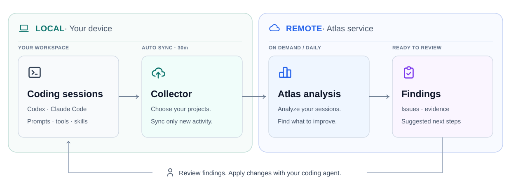

# AgentSession Atlas

Understand your coding agent sessions.

Our focus is evidence-preserving collection and distillation: keep the context needed to evaluate prompts, skills, and agent workflows.

Collect Codex and Claude Code records, explore usage, and turn analysis into concrete actions with supporting evidence. Sign in with GitHub to keep your history and configure your own AI provider.

[Open Atlas](https://agent-session-atlas.vercel.app) · [Collector 0.4.0](https://github.com/agent-observatory/agent-session-atlas/releases/tag/collector-v0.4.0) · [User guide](https://agent-session-atlas.vercel.app/docs) · [Architecture (Korean)](docs/README.md)

Korean and English. Dark and light themes. Hermes support is planned.
