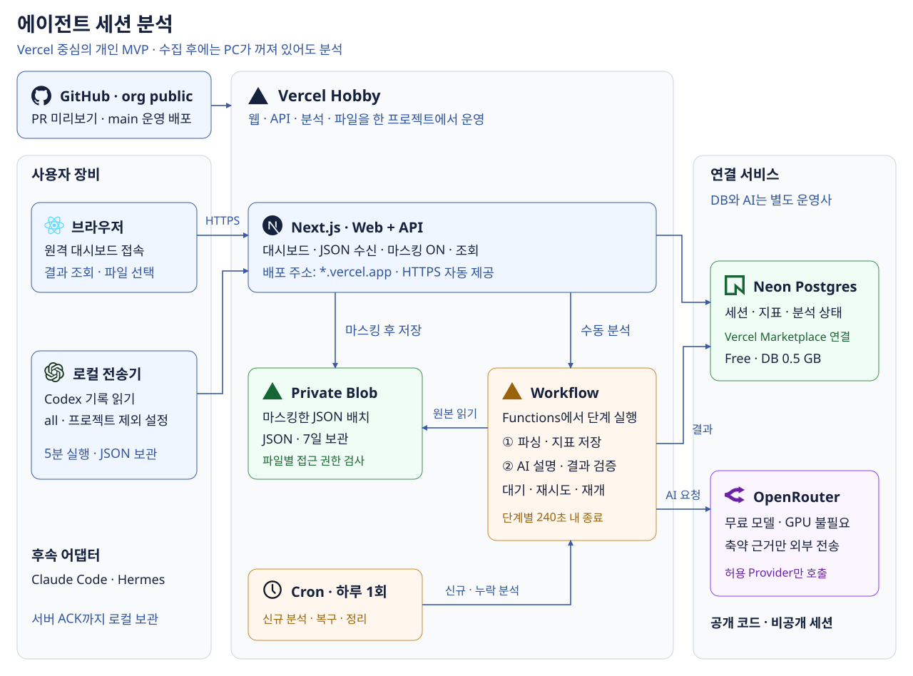

# AgentSession Atlas



**에이전트 세션을 모아 사용량·작업 흐름·개선점을 분석한다.**  
Agent Observatory의 프로젝트. Codex부터 시작하고 Claude Code·Hermes로 확장한다.

현재는 **설계 단계**다. 애플리케이션·npm 패키지·Vercel 서비스는 아직 배포하지 않았다.

| 항목 | 결정 |
|---|---|
| 구성 | 모노레포 1개, Next.js와 로컬 수집기 2개 |
| 전송 | 로컬에서 5분마다 일반 JSON 전송. 영속 대기 파일·재시도·중복 접수 방지 |
| 선택 | 프로젝트 기본값 `all`, 허용·제외 목록 |
| 마스킹 | Next.js 서버에서 기본 활성화 |
| 분석 | 원격에서 하루 1회 또는 수동 실행 |
| 배포 | Vercel + Neon + OpenRouter. 초기에는 설정·스크립트로 관리 |
| UI | 한 페이지 대시보드, 구현 시 다크모드 기본 |

[전체 설계 문서](docs/2609-agent-session-atlas.md)에서 대시보드 샘플, 수집기 설치, 장애 복구, 배포 구조를 확인한다.

## 저장소 구성

```text
README.md                    # 프로젝트 소개·현재 상태
AGENTS.md                    # 작업 원칙
docs/                       # 설계 문서·SVG
assets/icons/                # 사용 아이콘·출처·라이선스
```

구현 시 `apps/web`, `apps/collector`, `packages/contracts`를 추가한다.  
수집기를 분리하면 `agent-observatory/agent-session-collector`를 사용하고 웹·API·분석은 이 저장소에 유지한다.

## 다음 구현

1. 공통 이벤트·배치·ACK 계약과 Codex 어댑터.
2. Next.js·Neon·Private Blob을 연결한 첫 원격 배포.
3. 일일·수동 Workflow 분석과 OpenRouter 설명.
4. npm 수집기 설치·5분 전송·장애 복구.

## 참고

설계는 [my-ai-study](https://github.com/Hyune-s-lab/my-ai-study)에서 시작해 이 저장소로 옮겼다.  
외부 자료의 반영 범위는 [설계 문서의 참고](docs/2609-agent-session-atlas.md#참고), 아이콘 출처는 [SOURCES.md](assets/icons/SOURCES.md)에 기록한다.
