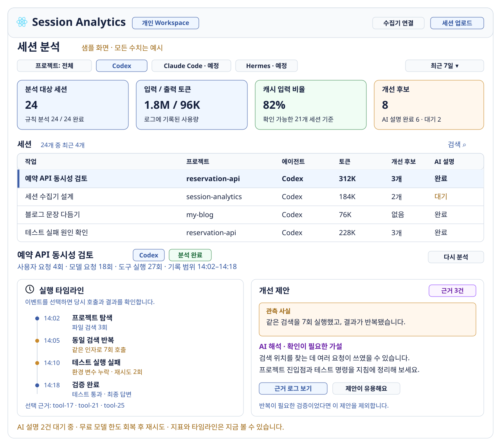
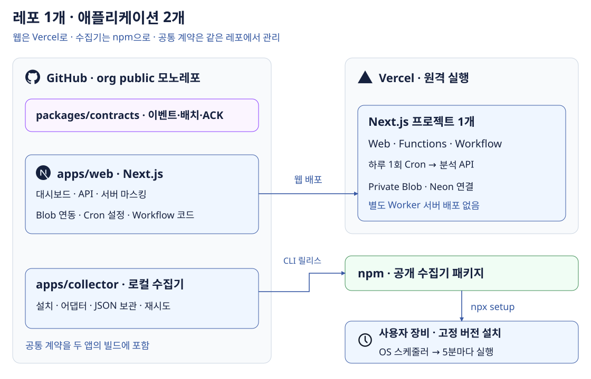
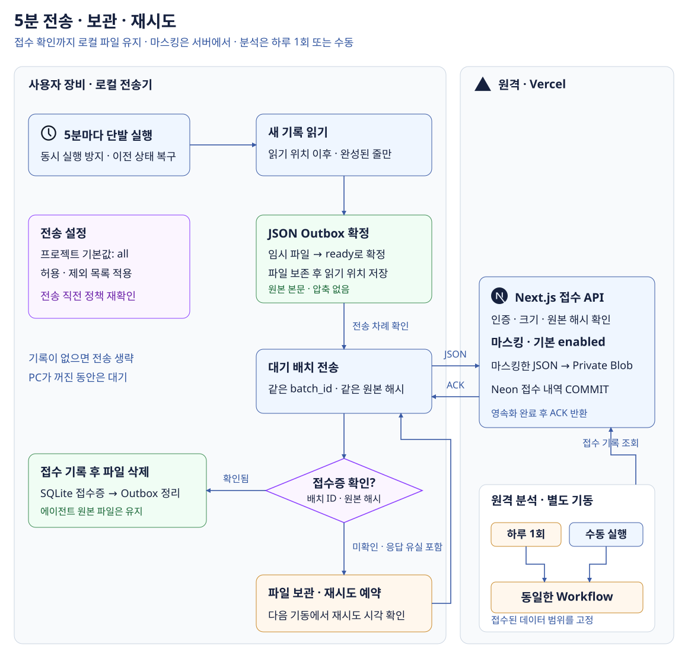

# AgentSession Atlas


**Agent Observatory**의 에이전트 세션 분석 서비스. 현재는 설계 단계이며 앱·수집기는 아직 구현하지 않았다.  
GitHub: [`agent-observatory/agent-session-atlas`](https://github.com/agent-observatory/agent-session-atlas)

## TL;DR

**선택한 프로젝트의 세션을 5분마다 동기화하고, 하루 한 번 또는 수동으로 분석한다.**  
Codex 어댑터부터 구현하고 Claude Code·Hermes를 연결한다. 통계는 코드로 계산하고 AI는 근거 해석을 맡는다.

| 항목 | 초안의 선택 |
|---|---|
| 수집 | 설치한 로컬 전송기가 5분마다 실행. 프로젝트 기본값 `all`, 허용·제외 목록 지원 |
| 분석 | 원격에서 하루 1회 또는 수동 실행 → 같은 Workflow. 접수된 데이터는 PC를 꺼도 분석 |
| 배포 | **Vercel + Neon + OpenRouter**. 웹·API·분석·파일은 Vercel 한 프로젝트 |
| 개발·배포 단위 | **모노레포 1개, 애플리케이션 2개**. Next.js는 Vercel 배포, 로컬 수집기는 npm 배포·`npx` 설치 |
| 비용 | **개인 비상업 MVP 월 $0 목표**. 무료 할당 안에서 보관량·호출량 제한 |
| 확장 | 개인 → 여러 에이전트 → 팀·다른 사용자의 파일 업로드 분석 |

## 대시보드



*합성 데이터로 만든 화면 예시. 세션을 선택하면 같은 페이지 아래에 상세 분석을 표시한다.*

**구현 디자인:** 모든 대시보드 화면은 다크모드를 기본으로 한다.
현재 SVG는 정보 배치 참고용이며, 색상·폰트·컴포넌트 스타일은 구현 시 다시 설계한다.

차가운 중성색 배경과 절제된 강조색으로 데이터·차트·타임라인의 가독성을 우선한다.
Claude를 연상시키는 따뜻한 베이지·주황 중심 스타일은 피하고, 세부 디자인은 구현 과정에서 결정한다.

## 애플리케이션과 저장소 구성

**Next.js 앱과 로컬 수집기, 총 2개를 만든다. 하나의 org public 모노레포에서 함께 관리한다.**  
Blob·Cron·Workflow는 Next.js 앱이 사용하는 관리형 기능이다. 별도 서버 애플리케이션으로 배포하지 않는다.



| 대상 | 직접 작성할 코드 | 플랫폼에 맡기는 부분 |
|---|---|---|
| Next.js | 대시보드·인증·접수·마스킹·조회 API | 웹 호스팅·Functions 실행·HTTPS |
| 로컬 수집기 | 설치·인증·어댑터·JSON Outbox·재시도·OS 등록 | npm은 패키지 배포, 사용자 OS는 5분 기동 |
| Blob | 서버 SDK로 저장·읽기·삭제, 접근 권한·보관 정책 | Private 저장소 생성·파일 보관 |
| Cron | `vercel.json` 일정 + 호출받을 API | 운영 배포의 API를 하루 한 번 GET 호출 |
| Workflow | 분석 순서·각 단계·재시도·결과 저장 코드 | 실행 상태 보존·중단 후 재개·단계 실행 |
| Neon | SQL 스키마·마이그레이션·쿼리 | PostgreSQL 서버·연결 관리 |

Blob은 **리소스 설정 + 사용 코드**, Cron은 **일정 설정 + API 코드**, Workflow는 **분석 코드**가 필요하다.  
Vercel이 실행 기반을 제공하며, 이 서비스의 분석 로직까지 만들어주지는 않는다.

```text
agent-session-atlas/             # 이 저장소의 구현 구조 제안
├── apps/
│   ├── web/                    # 유일한 Vercel 프로젝트, Root Directory
│   │   ├── app/api/            # ingest, analyses, cron/daily, device 연결
│   │   ├── workflows/          # 분석 흐름과 단계 함수
│   │   ├── lib/                # 마스킹·Blob·Neon·AI 접근
│   │   ├── next.config.ts      # withWorkflow 통합
│   │   └── vercel.json         # 원격 Cron 일정
│   └── collector/              # npm에 공개할 CLI·설치·OS 스케줄러
├── packages/contracts/         # 공통 이벤트·배치·ACK 스키마와 버전
├── db/migrations/              # SQL 변경 이력
├── ops/                        # 환경별 비밀값 없는 리소스 설정
├── scripts/                    # 인프라 준비·배포·검증 스크립트
├── .github/workflows/          # CI·웹 배포·npm 릴리스
└── pnpm-workspace.yaml         # 공통 lockfile, 별도 앱 버전
```

공통 계약을 한 PR에서 수정할 수 있어 초기에는 1개 레포가 편하다. `pnpm workspace`부터 시작한다.  
공통 패키지는 CLI 배포물에 포함하고, 수집기 사용자가 레포를 clone하거나 pnpm을 설치할 필요는 없게 한다.

웹과 CLI 릴리스는 분리한다. 웹은 main 변경 시 배포하고, CLI는 버전 태그가 있을 때만 npm에 게시한다.  
설치된 구버전 수집기가 남으므로 `schema_version`을 보내고 서버부터 하위 호환으로 배포한다.

레포 분리는 담당 팀·접근 권한·릴리스 운영이 달라질 때 검토한다. 공통 패키지는 별도 애플리케이션으로 세지 않는다.  
분리 시 웹은 이 저장소에 유지하고 수집기는 `agent-observatory/agent-session-collector`로 옮긴다.

### 사용자 설치: npx setup

**Node.js 지원 LTS와 npm이 설치된 macOS부터 지원한다.** Windows·Linux 스케줄러는 후속으로 둔다.  
아래 npm scope·패키지는 사용할 이름의 제안이다. 버전·명령은 구현 예시이며 아직 게시되지 않았다.

```sh
npx @agent-observatory/collector@0.1.0 setup
```

`npx`는 패키지를 받아 실행하는 진입점이다. **영구 설치와 자동 실행 등록은 우리가 `setup`으로 구현한다.**

| 단계 | setup이 하는 일 |
|---|---|
| 설치 | 배포 버전을 앱 전용 폴더에 설치. npm 임시 캐시와 분리하고 관리자 권한 없이 사용자 영역에 설치 |
| 계정 연결 | 브라우저 로그인 후 일회용 코드로 기기 연결. CLI에는 해당 Workspace 전송·접수 조회용 토큰만 발급 |
| 수집 설정 | 기본 `all`, 제외 프로젝트·목적지를 보여주고 설정 저장. 연결·설정 완료 후 자동 전송 시작 |
| 자동 기동 | `launchd` 사용자 LaunchAgent에 300초 간격 등록. Node·설치 CLI의 절대 경로 사용 |
| 확인 | 시험 연결과 스케줄러 상태 확인. 대기 배치 수·최근 ACK·다음 재시도 시각 표시 |

5분마다 `npx …@latest`를 실행하지 않는다. **로컬에 설치된 고정 버전**을 실행해야 네트워크 장애에도 기동할 수 있다.  
MVP는 설치된 Node를 사용하며, Node 경로가 바뀌면 `doctor`로 감지하고 `setup` 재실행으로 등록을 복구한다.

| CLI 명령 제안 | 동작 |
|---|---|
| `status` / `doctor` | 전송 상태 조회 / 인증·Node 경로·스케줄러·디스크 진단 |
| `sync` | 즉시 한 번 전송. 원격 AI 분석은 대시보드에서 별도 기동 |
| `pause` / `resume` | 로컬 자동 전송 일시 중지·재개 |
| `update` | 새 버전 설치·검사 후 실행 경로 교체. 실패하면 기존 버전 유지, Outbox·설정 보존 |
| `uninstall` | 스케줄러·프로그램 제거. 미접수 기록·설정은 기본 보존하고 명시적 삭제에서만 제거 |

`setup` 재실행은 등록을 복구하며 중복 LaunchAgent를 만들지 않는다. 기기 토큰은 macOS Keychain에 보관한다.  
npm 계정·게시 권한은 운영자만 필요하다. 사용자는 공개 패키지 설치에 npm 로그인이 필요하지 않다.

## 수집과 전송

**로컬 전송기는 기록의 전송만 맡고, 분석은 원격에서 실행한다.**
사용자가 한 번 설치하면 OS 스케줄러가 5분마다 실행한다. macOS는 `launchd`를 사용한다.

본문·도구 입출력을 확보하기 위해 세션 파일을 읽는 방식을 기본으로 한다.
내장 OTel은 에이전트별 내용·잘림 범위가 달라 후속 보완 경로로 둔다.

```yaml
# 이 서비스의 로컬 전송기 설정 제안
sources:
  codex: { enabled: true, home: "~/.codex" }
  claude_code: { enabled: false } # 후속 어댑터
  hermes: { enabled: false }

collection:
  projects:
    mode: all # all | allowlist
    include: []
    exclude: ["~/work/company/**"]

upload:
  mode: automatic # automatic | manual
  interval_minutes: 5
  workspace: personal
  format: json
  max_request_bytes: 1048576 # 직렬화한 HTTP 본문 1 MiB
  compression: none
  outbox_dir: "~/.agent-session-atlas/outbox"
  max_pending_mb: 1024
  retry_backoff_minutes: [5, 10, 20, 40, 60]

analysis:
  schedule: daily # 원격 하루 1회. 대시보드 수동 실행도 제공
  external_ai: true
```

| 선택 범위 | 규칙 |
|---|---|
| 프로젝트 | `exclude` 우선. 정규화한 경로로 비교하고 경로 미상은 자동 전송 제외 |
| 자동·수동 전송 | 기본은 설정 범위의 새 기록 자동 전송. `manual`은 선택 시점까지의 기록만 대기열에 등록 |
| 본문 | 사용자·에이전트 메시지와 기록에 남은 도구 입출력. 인증 파일·소스 전체·첨부 바이너리는 수집 제외 |
| 마스킹 | **Next.js 서버에서 기본 `enabled: true`**. 수신 본문을 마스킹한 뒤 Blob·DB에 저장. MVP에서는 해제 옵션을 노출하지 않음 |
| 설정 변경 | 실제 전송 직전 정책을 다시 검사. 제외된 미전송 기록은 차단하며, 이미 서버에 보낸 기록은 별도 삭제 |
| 목적지 | 대기 파일에 Workspace·계정·기기·정책 버전을 고정. 설정을 바꿔도 기존 파일의 목적지는 바뀌지 않음 |

프로젝트 경로는 전송 대상을 고르는 기준이며, 붙여넣은 내용까지 개인 데이터라고 판별하지는 않는다.
브라우저 파일 업로드도 같은 서버 수신·마스킹 경로를 사용한다.
로컬 대기 파일과 HTTPS 요청에는 원본 본문이 포함된다. 서버는 원본을 로그·Blob·Workflow 기록에 남기지 않는다.

### 5분 전송과 장애 복구



임시 파일은 OS가 청소하는 `/tmp`가 아닌 **앱 전용 영속 폴더**에 둔다.
MVP는 압축하지 않은 **일반 JSON의 `events` 배열**을 사용하고, 같은 목적지의 새 기록을 한 배치로 묶는다.

```text
~/.agent-session-atlas/
├── state.sqlite              # 읽기 위치·배치 상태·재시도 시각·접수증
└── outbox/
    ├── .staging/<id>.json     # 작성 중: 전송 금지
    └── ready/<id>.json        # 확정 파일: 재시작 후에도 전송 가능
```

각 JSON 파일은 `manifest`와 `payload`를 포함한다.
`manifest`에는 목적지·원본 파일 구간·전송 본문 SHA-256, `payload`에는 고정 `batch_id`와 `events`를 둔다.


| 순서 | 처리·완료 기준 |
|---|---|
| 1. 기동·복구 | OS 파일 잠금으로 동시 실행 방지. 이전 실행이 진행 중이면 종료. 만료된 전송 lease와 대기 파일부터 복구 |
| 2. 새 기록 읽기 | 파일별 읽기 위치 이후의 **완성된 JSONL 줄**만 읽음. 쓰는 중인 마지막 줄은 다음 실행까지 대기 |
| 3. 대기 파일 확정 | JSON 작성 → 파일 동기화 → 같은 파일시스템의 `ready`로 atomic rename → 부모 디렉터리 동기화. 로컬에서는 마스킹하지 않음 |
| 4. 읽기 위치 저장 | 파일 확정 후 SQLite 트랜잭션으로 배치 등록·읽기 위치 갱신. 서버 전송 성공 여부와 분리 |
| 5. 전송 | 재시도 시각이 지난 배치부터 처리. 실제 전송 본문을 1 MiB 이하로 제한하고 Next.js API에 JSON POST |
| 6. 서버 접수 | 인증·크기·원본 해시 확인 → 마스킹 → Private Blob 저장 → Neon 배치 접수·세션 변경 COMMIT → ACK |
| 7. 로컬 정리 | ACK의 `batch_id`·`received_sha256`을 확인하고 SQLite에 접수증 저장. 그다음 대기 파일 삭제. 에이전트 원본은 유지 |

**ACK는 서버의 보관·접수가 끝났다는 뜻이다. 분석 완료를 기다리지 않는다.**
변경이 없고 재시도할 배치도 없으면 네트워크 호출 없이 종료한다. 실행당 작업량을 제한하고 나머지는 다음 기동에서 처리한다.

| 장애·경계 상황 | 처리 |
|---|---|
| 오프라인·timeout·5xx | 파일 유지. 5 → 10 → 20 → 40 → 최대 60분 간격에 작은 jitter를 더해 재시도 시각 저장. 재시도 대상은 다음 5분 기동에서 확인 |
| 429 | `Retry-After`와 자체 backoff 중 늦은 시각 적용. 서버가 막혀도 새 기록은 로컬 여유 공간까지 보관 |
| 401·403 / 잘못된 배치 | 자격증명 오류는 목적지 전송 중지, 스키마 오류·동일 ID의 다른 해시는 해당 배치 격리. 파일 보관·사용자 조치 후 재개 |
| 서버 처리 중 통신 단절 | 같은 ID로 접수 상태를 먼저 조회. 미접수면 동일 JSON 재전송. 진행 중이면 대기하고, Blob만 남았으면 서버가 이어서 접수 |
| 서버 COMMIT 후 ACK 유실 | 같은 ID·해시로 다시 접수하면 기존 접수증 반환. 서버에 이벤트·분석 대상을 중복 등록하지 않음 |
| 파일 확정 후 SQLite 기록 전 종료 | 시작 시 `ready` JSON의 manifest를 대조해 미등록 배치·읽기 위치 복구. 확정 파일은 수정하지 않고 같은 ID로 전송 |
| 미완성 파일·파일 유실 | `.staging`은 미전송 상태로 재생성. 등록된 대기 파일이 사라졌으면 읽기 위치를 되돌려 원본 재수집, 원본도 없으면 누락 표시 |
| 원본 교체·잘림 | 파일 식별자·내용 변경을 감지해 새 generation 부여. 기존 cursor를 새 파일에 적용하지 않음 |
| 절전·재부팅 / 디스크 가득 참 | 복귀 후 읽기 위치에서 재개. 대기 용량 상한이면 새 수집을 멈추고 알림. 미접수 파일은 나이·실패 횟수만으로 삭제하지 않음 |

서버는 원본 해시(`received_sha256`)와 마스킹 후 저장 해시(`stored_sha256`)·마스킹 버전을 구분해 보존한다.
마스킹에 실패하면 ACK 없이 실패 처리하며 원문 저장으로 우회하지 않는다.

`batch_id`는 처음 만들 때 고정하고 재시도에서도 유지한다. 서버는 `(workspace, owner, device, batch_id)`를 유일 키로 쓴다.
이벤트에도 출처 ID 또는 `(device, file_generation, byte_offset)`을 부여해 재수집·배치 재구성 시 중복을 제거한다.

읽기 위치는 **로컬에 안전하게 복사한 지점**, 접수증은 **서버에 안전하게 접수된 지점**이다.
전송 상태는 `pending → sending → acknowledged`, 실패하면 `pending`, 조치가 필요하면 `blocked`로 관리한다.

### 원격 분석: 자동과 수동

| 기동 방식 | 처리 범위 |
|---|---|
| 하루 1회 Cron | 새로 접수되거나 변경된 세션 중 미분석 범위를 선택. 정리·미시작 작업 복구도 수행 |
| 대시보드 수동 실행 | 선택한 프로젝트·세션·기간을 바로 분석. 필요하면 명시적으로 재분석 |
| 공통 Workflow | 시작 시 **접수된 배치 목록·데이터 revision을 고정**하고, 지표 → AI 설명 순서로 저장 |

접수 API는 데이터를 저장하고 분석 필요 상태만 표시한다. 업로드할 때마다 Workflow를 실행하지 않는다.
같은 세션·revision·분석 버전은 한 번만 등록한다. 실행 중 추가·지연 도착한 데이터는 다음 분석 대상이다.

## 분석 구성

| 계층 | 맡는 일 | 구현 제안 |
|---|---|---|
| 로컬 전송기 | 5분마다 새 기록 발견·선택·보관·전송 | TypeScript CLI + JSON Outbox + SQLite |
| Source Adapter | 에이전트별 기록을 공통 이벤트로 변환 | Codex 먼저, Claude Code·Hermes 후속 |
| API | 인증·JSON 수신·마스킹·멱등 접수·조회·수동 분석 | Next.js Route Handlers → Vercel Functions |
| 분석 | 지표·규칙 분석, AI 요청·결과 검증 | Vercel Workflow가 Functions의 짧은 단계를 실행 |
| Web | 목록에서 세션 선택, 타임라인·개선안 조회 | Next.js + React. API와 같은 주소·프로젝트 |

공통 이벤트는 세션·턴·모델 요청·도구 실행·사용량이다.  
각 어댑터가 지원 범위를 알리고, 기록에 없는 값은 `0` 대신 `unknown`으로 표시한다.

| 코드로 계산 | AI가 해석 |
|---|---|
| 입력·캐시·출력 토큰, 요청·도구 실행 횟수 | 반복 호출이 불필요했을 가능성과 반례 |
| 동일 검색·오류·큰 응답 구간 | 사전에 제공하면 좋았을 맥락 |
| 원본 이벤트 위치와 관측 시간 | 프롬프트·스킬·작업 분할 개선 제안 |

### AI 실행 선택

| 방식 | 실행 위치 | 판단 |
|---|---|---|
| **OpenRouter 무료 모델** | Workflow의 AI 단계 → 외부 모델 Provider | **기본안.** PC가 꺼져 있어도 처리. 무료 한도·데이터 정책에 맞는 모델만 사용 |
| 개인 Codex Runner | 본인 PC → OpenAI → 결과를 서버에 업로드 | 기존 플랜 활용 대안. PC 가동·플랜 한도 필요. 공유 서비스 기본 자격증명으로 쓰지 않음 |
| 직접 모델 호스팅 | 원격 CPU·GPU 서버 | 데이터 통제가 필요하거나 처리량이 늘면 검토. 초기 운영 범위에서는 제외 |

`codex exec`는 기존 CLI 인증을 재사용할 수 있다. 로컬 실행이어도 추론 입력은 OpenAI에 전달된다.  
구독이 불특정 사용자용 API 사용권을 뜻하지는 않는다. [Codex 공식 문서](https://learn.chatgpt.com/docs/non-interactive-mode)

| 무료 AI 운영 규칙 | 제안 |
|---|---|
| 모델 선택 | 합성 입력은 `openrouter/free`, 운영은 평가를 통과한 무료 모델·Provider 고정 |
| 입력 | 전체 로그 대신 지표 + 최대 5개 근거 구간. 입력 약 8K·출력 1.5K tokens 상한 |
| 호출량 | 하루 세션 20개 가정. 재시도 포함 자체 상한 40회/일, 동시 1회 |
| 외부 한도 | 공식 FAQ 기준 기본 50회/일. $10 이상 크레딧 구매 시 1,000회/일. 계정 전체 한도 |
| 무료·데이터 조건 | 가격 0과 허용 Provider 확인. `max_price` 입력·출력 0, `data_collection: deny`, `zdr: true` |
| 조건 불충족·429 | AI 대기 상태와 다음 시도 시각 표시. 정책 완화·유료 대체 없음 |
| 실패 종료 | 최대 3회 호출 또는 72시간 경과 시 실패. 기본 지표 유지·수동 재분석 제공 |
| 결과 검증 | JSON 형식·근거 ID 검사. 근거 없는 결론은 게시하지 않음. 모델에 도구 실행 권한 없음 |

무료 모델과 데이터 정책을 동시에 만족하는 Provider가 없으면 설명 생성은 보류한다.  
실제 모델·한도는 배포 시 재확인하고, 20개 세션으로 설명의 유용성을 평가한다. [모델 목록](https://openrouter.ai/models) · [한도](https://openrouter.ai/docs/faq)

## 배포: Vercel 중심으로 통합

**GitHub org public 저장소를 본인의 Vercel Hobby에 연결한다.**  
Neon은 Marketplace에서 생성·연결하고 결제도 Vercel로 통합할 수 있지만, DB 운영사는 Neon이다.

| 구성요소 | 어디에 배포하나 | 무료 범위·설계 선택 |
|---|---|---|
| Web · API | Vercel의 Next.js 프로젝트 | `*.vercel.app`·HTTPS. 별도 VM·도메인 구매 불필요 |
| 분석 실행 | Vercel Workflow + Functions | 함수 최대 300초(Fluid Compute). 단계마다 240초 안에 종료·진행 위치 저장 |
| 원본 파일 | **Vercel Private Blob** | 저장 1 GB-month, 전송 10 GB/월. 공개 Blob 사용 금지 |
| PostgreSQL | **Neon Free**, Marketplace 연결 | 프로젝트당 0.5 GB·100 CU-hours/월. 유휴 시 scale-to-zero |
| AI | OpenRouter 무료 모델 | 외부 호출 허용 시에만 실행. 계정 단위 일일 예산 검사 |
| 자동 분석·정리 | Vercel Cron 하루 1회 | 신규 분석·누락 작업 복구·만료 삭제. 수동 분석 API는 별도 제공 |
| 로그인 | 앱 내부 인증 + GitHub OAuth | 본인 GitHub ID만 허용. 수집기는 폐기 가능한 전송 토큰 사용 |

2026-09-11 공식 문서 확인 기준이다. **Hobby는 개인 비상업 용도**이며 회사 업무·팀 서비스는 플랜을 재검토한다.  
무료 할당은 무기한 가동 보장이 아니다. 한도를 넘으면 기능이 중단될 수 있고 유료 전환은 별도 결정한다.

### 인프라 관리: 설정 파일 + 스크립트

**초기에는 Terraform 없이 설정 파일·TypeScript 스크립트·GitHub Actions로 관리한다.**  
리소스 수가 적으므로 Vercel CLI/API를 감싼 스크립트로 시작한다. 아래 파일·명령은 구현 예정 계약이다.

| 관리 대상 | 코드로 관리할 위치·방식 |
|---|---|
| Vercel 프로젝트 | `ops/production.json`에 이름·리전·`apps/web` 경로·리소스 ID. `scripts/infra.ts`로 조회·생성·연결 |
| Private Blob | CLI/API로 저장소 조회 후 없을 때 생성·연결. private 여부를 검사하고 기존 파일은 보존 |
| Neon | 최초 Marketplace 연결·동의 후 프로젝트 ID 기록. 이후 스크립트로 연결 확인, SQL migration으로 스키마 관리 |
| Cron | `apps/web/vercel.json`에 일정, `app/api/cron/daily/route.ts`에 인증·대상 선택·Workflow 시작 |
| Workflow | `workflows/*.ts`의 `use workflow`·`use step`, `next.config.ts`의 `withWorkflow`. Next.js와 함께 배포 |
| 환경변수 | `.env.example`에 이름만 기록. 실제 키는 Vercel 환경변수·GitHub Secrets, CLI 기기 토큰과 분리 |
| 웹 배포 | Actions에서 검사 → DB migration → Vercel CLI 배포 → 원격 smoke test |
| CLI 배포 | CLI 태그 → 빌드·패키지 설치 검사 → npm 공개 게시. 최초 게시 후 npm Trusted Publishing 연결 |

운영 배포는 Actions로 통일하고 Vercel Git 자동 배포와 중복 실행하지 않는다. PR Preview도 별도 환경으로 배포한다.  
Vercel은 `apps/web`만 배포하되 `packages/contracts`를 빌드에 포함한다. 수집기는 Vercel 배포 대상에서 제외한다.

```json
{
  "crons": [
    { "path": "/api/cron/daily", "schedule": "0 18 * * *" }
  ]
}
```

UTC 18시는 한국 시간 다음 날 03시다. Hobby의 실행 시각 오차를 허용하고, API에서 `CRON_SECRET`을 검증한다.  
Cron API는 미분석 작업을 등록하고 반환한다. 수동 분석 API도 같은 Workflow를 시작한다.

| 운영 명령 제안 | 책임 |
|---|---|
| `pnpm infra:plan` / `pnpm infra:apply` | 현재 리소스와 설정 비교 / 없는 리소스 생성·연결. 반복 실행 가능하며 자동 삭제 없음 |
| `pnpm db:migrate` | 버전이 있는 SQL을 한 번만 적용. 웹 배포보다 먼저 실행 |
| `pnpm deploy:preview` / `pnpm deploy:prod` | 지정 환경 빌드·배포. 운영 키를 PR Preview에 전달하지 않음 |
| `pnpm smoke:remote` | 합성 세션 접수·중복 ACK·수동 분석·조회·삭제까지 확인 |

계정 가입·OAuth/Marketplace 동의·최초 npm 게시와 신뢰 연결은 초기 수동 절차로 기록한다.  
그 이후 반복 운영을 스크립트로 재현한다. `infra:plan`은 자체 비교 명령이며 Terraform 수준의 상태 관리까지 구현하지 않는다.

팀·환경이 늘어 리소스 변경 추적이 복잡해지면 Terraform을 도입한다. 그때도 분석 코드·SQL·CLI 설치 코드는 각각 유지한다.

### 무료 운영 범위

| 항목 | MVP에서 적용할 상한 |
|---|---|
| 원본 | 마스킹한 비압축 JSON 7일 보관. 전체 Blob **700 MB**에서 새 전송 중지하고 로컬 대기. 실제 저장 바이트로 제한 |
| 크기 예산 | 하루 신규 기록 총 40 MB 가정 시 7일 약 280 MB. 세션 전체 재전송 없이 추가분만 전송 |
| 파일 요청 | 5분당 목적지별 한 배치. 하루 4시간 변경 시 월 약 1,440회 업로드. 8시간이면 2,880회로 고급 작업 무료 2,000회 초과 |
| DB | 지표·메타데이터·근거 위치 위주. 전체 도구 출력은 Blob에 두고 DB 350 MB에서 경고·신규 입력 제한 |
| 함수 | Hobby 4 CPU-hours·360 GB-hours/월. 대기에도 메모리 시간이 잡히므로 긴 대기는 Workflow로 넘김 |
| Workflow | 월 50,000 events·기록 1 GB, 내부 Queues 월 100만 operations 무료 범위까지 함께 확인 |
| 결과·관측 | 결과 90일, 상세 이벤트 7일. Workflow 실행 기록은 완료 후 1일이므로 제품 결과는 Neon에 저장 |

재시도·분할·목록 조회·세션 삭제를 위한 객체 재작성도 요청량에 포함한다. 무료 한도 부족 시 대기·주기 조정·플랜 변경 중 선택한다.
같은 계정의 다른 프로젝트 사용량과 Preview도 예산에 포함한다. 함수·Blob 전송량은 무료 사용량 화면에서 함께 확인한다.  
상한의 80%에서 화면에 알리고, 한도에 닿기 전에 새 입력·AI 재시도를 멈춘다.

### 비동기 실행과 배포 완료 조건

| 단계 | 구현·확인할 내용 |
|---|---|
| 업로드 | 로컬·브라우저 → Next.js에 JSON POST. 서버 마스킹 후 서버 자격증명으로 Private Blob에 저장 |
| 접수 | 마스킹한 객체 저장 후 배치·세션 변경 정보를 Neon에 COMMIT하고 ACK. 분석은 Cron·수동 API가 별도 등록 |
| 규칙 분석 | 확정한 배치 목록의 JSON을 읽어 지표·근거 위치 저장. 배치 크기를 제한해 단계별 처리 |
| AI 설명 | 근거만 읽어 호출·검증·저장. 120초 요청 timeout, 지연은 Workflow sleep 후 재개. 브라우저 종료와 무관 |
| 운영 배포 | org public 연결 → Neon·Private Blob 생성 → 환경변수 설정 → 마이그레이션 → Vercel 운영 배포. DB와 함수는 같은 리전 우선 |
| 배포 검증 | 5분 전송·수동/일일 분석·조회·삭제 확인. 서버 장애와 ACK 유실 후 재전송해도 중복 없는지 검증 |
| 재배포 | PR Preview는 합성 데이터·별도 DB/Blob. 운영 자격증명을 전달하지 않고 CI 통과 후 main 병합 |
| 복구 | 배포 전 DB export, 이전 앱 버전과 호환되는 마이그레이션. 앱 rollback과 DB 복원은 별도로 검증 |

Functions의 **4.5 MB 본문 제한** 안에서 동작하도록, MVP는 JSON 요청 전체를 **1 MiB** 이하로 제한한다.
큰 입력은 이벤트 경계로 배치를 나누며, 단일 이벤트도 초과하면 조용히 자르지 않고 격리·표시한다.  
Workflow에는 ID·진행 위치만 넘기고, 파일 내용이나 전체 모델 응답을 실행 기록에 중복 저장하지 않는다.

## 데이터 경계

| 경계 | 지킬 것 |
|---|---|
| 사용자·팀 | 모든 데이터에 Workspace·소유자 연결. 본인 로그인부터 시작, 팀 집계와 원문 열람 권한 분리 |
| 업로드 | 전송은 일반 JSON, 원본 파일의 JSONL 형식은 어댑터가 해석. 직렬화한 요청 전체 1 MiB 상한을 클라이언트·서버 양쪽에서 검사 |
| 저장 | 서버에서 마스킹한 JSON만 Blob에 저장 후 DB 등록. 미등록 객체는 유예 후 정리. 공개 저장소에는 합성 fixture만 포함 |
| 중복·재개 | 배치·이벤트 유일 키로 중복 제거. 기기 등록이 유효한 동안 최소 접수증 보존. 삭제한 세션은 tombstone으로 재접수 차단 |
| 토큰·시간 | 누적·요청별 토큰, 부모·자식 세션, 병렬 실행 중복 집계 방지. 구독 청구액으로 표현하지 않음 |
| 작업 복구 | Workflow 재실행을 전제로 작업 키·lease로 중복 분석 방지. AI 예산도 DB에서 원자적 예약. 외부 호출 중 트랜잭션 유지 금지 |
| 재분석 | 원본과 파서·규칙·프롬프트 버전 보존. 규칙 결과와 AI 설명 상태 분리 |
| 보관·삭제 | 원본·상세 이벤트 7일, 요약 90일. 혼합 배치에서 세션 삭제 시 나머지만 새 객체로 복사·참조 교체 후 이전 객체 삭제 |
| 백업 | Neon Free 복원 창 최대 6시간. 주 1회 암호화 DB export를 본인 PC에 보관. 복원 후 별도 삭제 기록·만료 정책 재적용 |

## 구현 순서

| 단계 | 결과물 |
|---|---|
| 1 | 공통 이벤트 계약 + Codex 어댑터 + 토큰·반복·오류 분석 |
| 2 | Next.js 한 페이지 + Neon·Blob 연결 + Vercel 최초 원격 배포 |
| 3 | 일일·수동 Workflow 분석 + OpenRouter 설명 + 한도·재시도·결과 검증 |
| 4 | npm 수집기 릴리스·npx setup·5분 전송·영속 Outbox. 깨끗한 macOS에서 설치·재부팅·업데이트·제거 확인 |
| 5 | 인프라·배포 스크립트와 CI. 오프라인·ACK 유실·마스킹 실패 복구를 포함한 원격 검증 |
| 이후 | Claude Code·Hermes 어댑터 → 팀 → 다른 사용자의 업로드 분석 |
| 후속 기능 기록 | **수동 업로드에서 마스킹을 끄는 선택지**. 현재는 구현하지 않으며 기본 활성화 유지 |

*검토용 설계 초안. 실제 배포·외부 세션 전송·무료 모델 품질 평가는 아직 수행하지 않았다.*

## 참고

| 자료 | 반영 범위 |
|---|---|
| [요즘IT](https://yozm.wishket.com/magazine/detail/3938/) · [Uber 원문](https://www.uber.com/gb/en/blog/efficient-software-factory/) | 세션 기록에서 개선 후보를 찾는 방향. 우버의 16개 규칙·절감률·컨텍스트 그래프는 재현하지 않음 |
| [Codex OTel](https://learn.chatgpt.com/docs/config-file/config-advanced) · [Claude Code Monitoring](https://code.claude.com/docs/en/monitoring-usage) | 내장 OTel의 본문 범위 차이. 원본 기록 전송을 기본으로 두고 OTel은 후속 보완 |
| [Codex Non-interactive mode](https://learn.chatgpt.com/docs/non-interactive-mode) | 기존 인증을 이용한 개인 Runner 대안. 공유 서비스 이용 허가로 확대 해석하지 않음 |
| [OpenRouter 모델 목록](https://openrouter.ai/models) · [Free Router](https://openrouter.ai/docs/guides/routing/routers/free-router) · [FAQ](https://openrouter.ai/docs/faq) | 무료 모델 선택·호출 한도. 실제 품질·처리 완료 시간 보장은 제외 |
| [Provider Routing](https://openrouter.ai/docs/guides/routing/provider-selection) · [Provider Logging](https://openrouter.ai/docs/guides/privacy/provider-logging) | 가격 상한·데이터 정책. 무료 endpoint 적합성은 배포 전 검증 |
| [Vercel Git](https://vercel.com/docs/git) · [Hobby](https://vercel.com/docs/plans/hobby) | org public 연동·개인 비상업 무료 운영. 회사 팀 운영은 무료 범위로 가정하지 않음 |
| [Functions](https://vercel.com/docs/functions/limitations) · [Cron](https://vercel.com/docs/cron-jobs/usage-and-pricing) | Fluid Compute 실행 시간·본문 크기·일일 정리 주기 |
| [Workflow](https://vercel.com/docs/workflows) · [요금](https://vercel.com/docs/workflows/pricing) · [Queues 요금](https://vercel.com/docs/queues/pricing) | 비동기 단계·재시도·실행 기록 보관. 내부 큐 사용량도 무료 예산에 포함 |
| [Blob](https://vercel.com/docs/vercel-blob) · [Blob 요금](https://vercel.com/docs/vercel-blob/usage-and-pricing) | 비공개 저장·서버 업로드·1 GB 저장 제한에 맞춘 보관 |
| [Neon Marketplace](https://vercel.com/marketplace/neon) · [Neon 요금](https://neon.com/pricing) | 관리 통합과 실제 DB 운영사 구분. 생성 화면의 Free 할당을 배포 전에 대조 |
| [Vercel Monorepos](https://vercel.com/docs/monorepos) · [Blob CLI](https://vercel.com/docs/cli/blob) | 단일 레포의 웹 배포 경로·공통 패키지, Private Blob 생성·관리 자동화 |
| [Cron 구성](https://vercel.com/docs/cron-jobs) · [Workflow Next.js 공식 예제](https://github.com/vercel/workflow/blob/main/docs/content/docs/v4/getting-started/next.mdx) | 일정 설정과 API 코드 구분, Workflow 코드를 Next.js에 통합·배포 |
| [npx](https://docs.npmjs.com/cli/v11/commands/npx/) · [npm Trusted Publishing](https://docs.npmjs.com/trusted-publishers/) | 패키지 실행·CI 게시. 영구 설치·기기 인증·OS 등록은 이 서비스가 별도로 구현 |

SVG의 글자와 도형은 편집 가능한 원본이다. 공용 아이콘은 내부 벡터로 포함하고 [출처·라이선스](../assets/icons/SOURCES.md)를 보존한다.  
한글 로컬 폰트를 우선하고 글자 크기·굵기 체계를 통일한다. 외부 웹폰트에는 의존하지 않는다.
