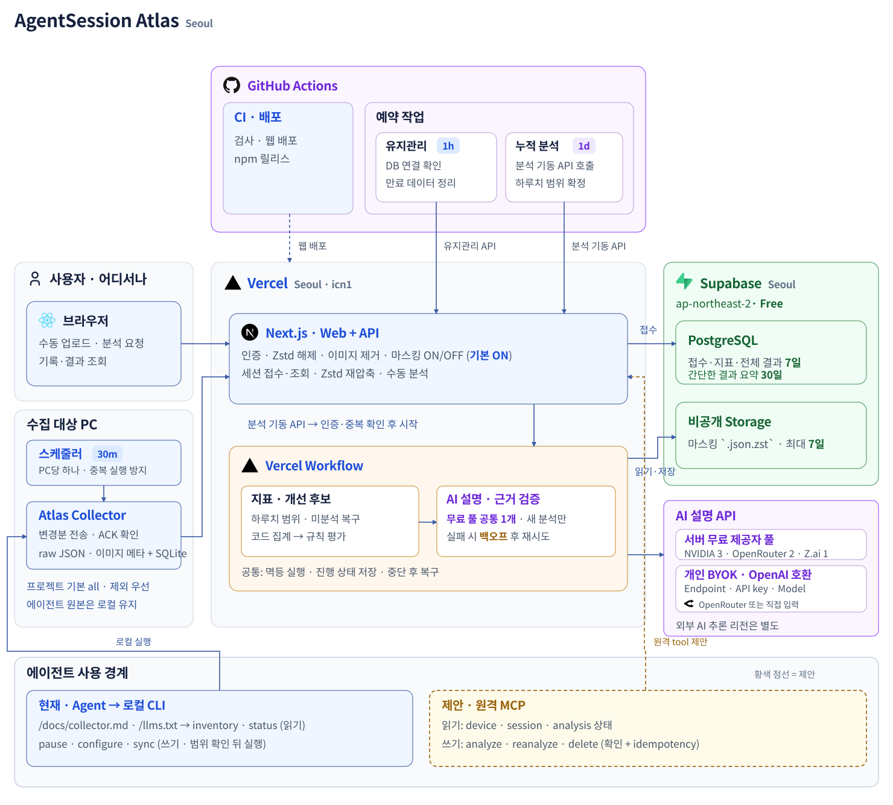
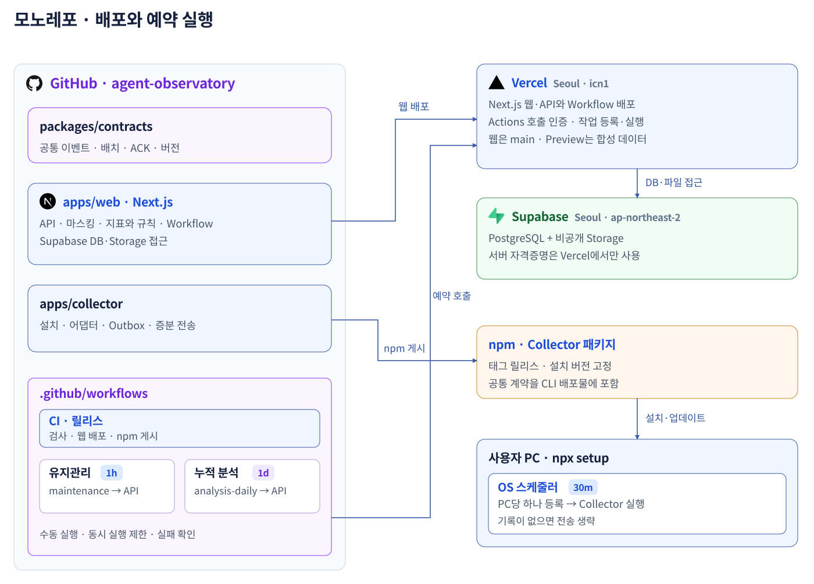

# 전체 흐름



[전체 흐름](README.md) · [Atlas](atlas.md) · [Collector](collector.md)

**AgentSession Atlas**는 세션을 보관·분석하는 웹 서비스다. **Atlas Collector**는 로컬 기록을 수집해 Atlas로 보내는 CLI다.

| 문서 | 범위 |
|---|---|
| 이 문서 | 전체 구조·공통 계약·현재 상태·구현 순서 |
| [Atlas](atlas.md) | 대시보드·로그인·AI 분석·BYOK·배포·운영 |
| [Collector](collector.md) | 설치·30분 실행·증분 수집·전송·복구 |
| [실제 작업 기록](implementation.md) | 소요 시간·검증 결과·남은 연결 작업 |

## 현재 상태

2026-09-11 확인 기준이다. 구현, 원격 검증, 배포 확인을 분리해 기록한다.

| 대상 | 확인한 상태 |
|---|---|
| Vercel | [운영 URL](https://agent-session-atlas.vercel.app) 공개 HTTP 200·Ready 배포 확인. Next.js 16.3.4, 기본 함수 리전 `icn1`, 최신 확인 배포 `dpl_5gTEvkph4akNnxX1yinKyEJfwkKv` |
| Supabase | 서울 Free 운영 연결. DB TLS·`SELECT 1`, 비공개 `sessions` 버킷의 합성 JSON 저장·조회·삭제와 익명 접근 차단 검증 |
| GitHub OAuth | 실제 Edge 브라우저에서 Hyune-c 회원가입·로그인·개인 공간 진입 성공 |
| 기본 AI | Z.ai `glm-4.7-flash` 합성 Collector 세션의 첫 시도 완료. `ops/remote-smoke.json`에서 한국어 결과·지표·마스킹 확인 |
| 개인 BYOK | OpenAI 호환 endpoint 설정·암호화 저장·연결 확인 UI와 SSRF 검증 코드 구현. 실제 사용자 키 연결은 원격 미검증 |
| GitHub Actions | main push 후 CI 성공. 유지관리 수동 실행·일일 분석 완료·Collector packaging 성공. 자연 예약 실행은 아직 관찰하지 않음 |
| Atlas·Collector | 웹/API/Workflow와 Collector 0.1.0 구현. rule isolation·`appliedRules` 버전 기록 포함. 계약 6·Collector 6·웹 SSRF 1, 총 13개 테스트 통과. 경계 8건·보관 5건 검증 통과. GitHub Release에서 tarball 설치 가능. npm은 인증 부재로 미게시. 개인 자동 수집은 사용자가 범위를 확인하도록 중지 |


## 핵심 결정

**선택한 프로젝트의 세션을 30분마다 동기화하고, 하루 한 번 또는 수동으로 분석한다.**  
Codex 어댑터부터 구현하고 Claude Code·Hermes를 연결한다. 통계는 코드로 계산하고 AI는 근거 해석을 맡는다.

| 항목 | 초안의 선택 |
|---|---|
| 수집 | 설치한 로컬 전송기가 30분마다 실행. 프로젝트 기본값 `all`, 허용·제외 목록 지원 |
| 분석 | 원격에서 하루 1회 또는 수동 실행 → 같은 Workflow. 접수된 데이터는 PC를 꺼도 분석 |
| 배포 | **Vercel 서울 + Supabase 서울 + Z.ai (BYOK: OpenAI 호환 endpoint)**. 웹·API·분석은 Vercel, DB·비공개 파일은 Supabase |
| 언어·테마 | 한국어·다크 기본. 설정에서 한국어/English, 라이트/다크/시스템 선택 |
| 첫 사용 | GitHub 회원가입·로그인 → 수집기 연결 → 기존 Codex 기록 가져오기 → 즉시 분석·결과 조회 |
| 개발·배포 단위 | **모노레포 1개, 애플리케이션 2개**. Next.js는 Vercel 배포, 로컬 수집기는 npm 배포·`npx` 설치 |
| 비용 | **개인 비상업 MVP 월 $0 목표**. 무료 할당 안에서 보관량·호출량 제한 |
| 확장 | 개인 → 여러 에이전트 → 팀·다른 사용자의 파일 업로드 분석 |

## 전체 흐름

| 순서 | 주체 | 처리 |
|---|---|---|
| 1 | Collector | 컴퓨터당 스케줄러 하나가 30분마다 Codex 신규·변경 기록을 확인하고 프로젝트 정책 적용 |
| 2 | Collector | 전송 본문을 Outbox에 확정하고 로컬 읽기 위치 저장 |
| 3 | Atlas 접수 API | 인증·검증·마스킹 설정 적용 후 Supabase Storage 저장과 Supabase DB 접수 확정 |
| 4 | Collector | 서버 ACK 확인 후 접수증 저장·대기 파일 정리 |
| 5 | Atlas | GitHub Actions의 일일 호출 또는 수동 요청으로 확정된 데이터 범위를 분석 |
| 6 | 대시보드 | 지표·근거·AI 설명·실제 모델 정보를 표시 |

브라우저는 Collector가 설치된 PC와 다른 기기에서도 접속할 수 있다. 웹 서비스는 Vercel에 배포하고 브라우저는 접속자의 기기에서 실행한다.
브라우저 수동 업로드는 Collector 설치 없이 Atlas의 수신·마스킹 경로를 사용한다. [전송·복구 상세](collector.md#30분-전송과-장애-복구) · [분석 상세](atlas.md#원격-분석-자동과-수동)

## 애플리케이션과 저장소 구성

**Next.js 앱과 로컬 수집기, 총 2개를 만든다. 하나의 org public 모노레포에서 함께 관리한다.**  
Storage·Workflow는 Next.js 앱이 사용하는 관리형 기능이며, 원격 일정은 GitHub Actions가 관리한다. 별도 서버 애플리케이션으로 배포하지 않는다.



| 대상 | 직접 작성할 코드 | 플랫폼에 맡기는 부분 |
|---|---|---|
| Next.js | 대시보드·인증·접수·마스킹·조회 API | 웹 호스팅·Functions 실행·HTTPS |
| 로컬 수집기 | 설치·인증·어댑터·JSON Outbox·재시도·OS 등록 | npm은 패키지 배포, 사용자 OS는 30분 기동 |
| Storage | 서버 SDK로 저장·읽기·삭제, 접근 권한·보관 정책 | Private 저장소 생성·파일 보관 |
| 예약 작업 | GitHub Actions 일정 + 호출받을 API | 시간당 유지관리·일일 분석 API 호출 |
| Workflow | 분석 순서·각 단계·재시도·결과 저장 코드 | 실행 상태 보존·중단 후 재개·단계 실행 |
| Supabase | SQL 스키마·마이그레이션·쿼리 | PostgreSQL 서버·연결 관리 |

Storage는 **리소스 설정 + 사용 코드**, Actions 예약 작업은 **일정 설정 + API 코드**, Workflow는 **분석 코드**가 필요하다.  
Vercel이 실행 기반을 제공하며, 이 서비스의 분석 로직까지 만들어주지는 않는다.

```text
agent-session-atlas/             # 이 저장소의 구현 구조 제안
├── apps/
│   ├── web/                    # 유일한 Vercel 프로젝트, Root Directory
│   │   ├── app/api/            # ingest, analyses, jobs, device 연결
│   │   ├── workflows/          # 분석 흐름과 단계 함수
│   │   ├── lib/                # 마스킹·Supabase DB·Storage·AI 접근
│   │   ├── next.config.ts      # withWorkflow 통합
│   │   └── vercel.json         # 함수 리전·실행 설정
│   └── collector/              # npm에 공개할 CLI·설치·OS 스케줄러
├── packages/contracts/         # 공통 이벤트·배치·ACK 스키마와 버전
├── db/migrations/              # SQL 변경 이력
├── ops/                        # 환경별 비밀값 없는 리소스 설정
├── scripts/                    # 인프라 준비·배포·검증 스크립트
├── .github/workflows/          # CI·배포·npm 릴리스·원격 예약 작업
└── pnpm-workspace.yaml         # 공통 lockfile, 별도 앱 버전
```

공통 계약을 한 PR에서 수정할 수 있어 초기에는 1개 레포가 편하다. `pnpm workspace`부터 시작한다.  
공통 패키지는 CLI 배포물에 포함하고, 수집기 사용자가 레포를 clone하거나 pnpm을 설치할 필요는 없게 한다.

웹과 Collector는 각 `package.json`에서 독립적인 SemVer를 관리한다. 공통 lockfile을 쓰더라도 버전을 함께 올리지 않는다.

| 대상 | 릴리스 식별 | 배포 |
|---|---|---|
| Atlas 웹 | `atlas-vX.Y.Z` | main 변경은 검증 후 Vercel 배포. 정식 릴리스에 웹 버전 태그 부여 |
| Collector | `collector-vX.Y.Z` | Collector 버전 태그에서만 패키지 검사 후 npm 게시 |
| 공통 계약 | `schema_version` | 앱 버전과 독립적으로 관리. CLI 배포물에 포함 |

웹만 변경하면 Collector 버전은 유지한다. 공통 계약 변경 시 양쪽 영향을 확인하되 일괄 버전 상승은 하지 않는다. 설치된 구버전 수집기를 위해 서버부터 하위 호환으로 배포하며, 지원하지 않는 스키마는 명시적으로 거절하고 전송 대기 파일을 보존한다.

레포 분리는 담당 팀·접근 권한·릴리스 운영이 달라질 때 검토한다. 공통 패키지는 별도 애플리케이션으로 세지 않는다.  
분리 시 웹은 이 저장소에 유지하고 수집기는 `agent-observatory/agent-session-collector`로 옮긴다.

## 공통 계약과 책임

| 계층 | 맡는 일 | 구현 제안 |
|---|---|---|
| 로컬 전송기 | 30분마다 새 기록 발견·선택·보관·전송 | TypeScript CLI + JSON Outbox + SQLite |
| Source Adapter | 에이전트별 기록을 공통 이벤트로 변환 | Codex 먼저, Claude Code·Hermes 후속 |
| API | 인증·JSON 수신·마스킹·멱등 접수·조회·수동 분석 | Next.js Route Handlers → Vercel Functions |
| 분석 | 지표·규칙 분석, AI 요청·결과 검증 | Vercel Workflow가 Functions의 짧은 단계를 실행. [개선 후보 규칙](atlas.md#개선-후보-규칙의-확장)은 개별 모듈·등록 목록·설정으로 추가·제거 |
| Web | 목록에서 세션 선택, 타임라인·개선안 조회 | Next.js + React. API와 같은 주소·프로젝트 |

공통 이벤트는 세션·턴·모델 요청·도구 실행·사용량이다.  
각 어댑터가 지원 범위를 알리고, 기록에 없는 값은 `0` 대신 `unknown`으로 표시한다.

`packages/contracts`는 두 앱이 공유하는 인터페이스 스키마다. TypeScript 타입·런타임 검증·계약 버전을 함께 관리하며 별도 서버로 배포하지 않는다.

## 데이터 경계

| 경계 | 지킬 것 |
|---|---|
| 사용자·팀 | 로그인 데이터에 Workspace·소유자 연결. 비로그인 분석은 방문자 접근 토큰·임시 보관 정책 적용. 팀 집계와 원문 열람 권한 분리 |
| 업로드 | 전송은 일반 JSON, 원본 파일의 JSONL 형식은 어댑터가 해석. 직렬화한 요청 전체 1 MiB 상한을 클라이언트·서버 양쪽에서 검사 |
| 저장 | 서버에서 Workspace의 마스킹 설정을 적용한 JSON을 Storage에 저장 후 DB 등록. 기본 켜짐이며 Settings → Privacy에서 변경. 미등록 객체는 유예 후 정리. 공개 저장소에는 합성 fixture만 포함 |
| 중복·재개 | 현재 배치는 `(owner, batch_id)`로 중복 제거. 로컬은 `configure`의 include/exclude/since/until과 `inventory` 집계를 사용하며, 삭제한 세션은 재접수 차단 |
| 토큰·시간 | 누적·요청별 토큰, 부모·자식 세션, 병렬 실행 중복 집계 방지. 구독 청구액으로 표현하지 않음 |
| 작업 복구 | Workflow 재실행을 전제로 작업 키·lease로 중복 분석 방지. AI 예산도 DB에서 원자적 예약. 외부 호출 중 트랜잭션 유지 금지 |
| 재분석 | 원본과 파서·규칙·프롬프트 버전 보존. 규칙 결과와 AI 설명 상태 분리 |
| 보관·삭제 | 원격 세션 파일·상세 이벤트·전체 분석 결과는 최초 접수부터 **최대 7일**, 간단한 결과 요약만 **최대 30일**. 요약에 원문·도구 출력·상세 근거를 남기지 않음. 재전송·재분석으로 만료 시각을 연장하지 않음. 혼합 배치에서 세션 삭제 시 나머지만 새 객체로 복사·참조 교체 후 이전 객체 삭제 |
| 백업 | Supabase Free는 자동 백업·PITR 미포함. 별도 DB export를 장기 보관하지 않음. 복원 후 서비스 재개 전에 삭제 기록·만료 정책 재적용 |

## 구현 순서

| 단계 | 결과물 |
|---|---|
| 1 | 공통 이벤트 계약 + Codex 어댑터 + 토큰·반복·오류 분석 |
| 2 | 한국어 대시보드·GitHub 회원가입/로그인·개인 Workspace·언어/테마/개인정보/BYOK 설정 + Supabase 연결 + Vercel 원격 배포 |
| 3 | 전체 세션 지금 분석·선택 세션·단일 세션 분석 + 일일 Workflow + 진행 상태·개별/종합 결과 + Z.ai 설명·재시도 검증 |
| 4 | 기존 Codex 기록 최초 가져오기·npm 수집기 릴리스·npx setup·30분 전송·영속 Outbox. 깨끗한 macOS에서 설치·재부팅·업데이트·제거 확인 |
| 5 | 인프라·배포 스크립트와 CI. 오프라인·ACK 유실·마스킹 실패 복구를 포함한 원격 검증 |
| 이후 | Claude Code·Hermes 어댑터 → 팀 → 다른 사용자의 업로드 분석 |
| 개인정보 설정 | MVP에서 민감정보 마스킹 켜기·끄기 제공. 기본 켜짐이며 수동 업로드·Collector에 같은 설정 적용 |

*구현 예정 순서다. 실제 완료 상태는 [문서 안내](README.md#현재-상태)에서 확인한다.*


## 참고 자료

| 자료 | 반영 범위 |
|---|---|
| [요즘IT](https://yozm.wishket.com/magazine/detail/3938/) · [Uber 원문](https://www.uber.com/gb/en/blog/efficient-software-factory/) | 세션 기록에서 개선 후보를 찾는 방향. 우버의 16개 규칙·절감률·컨텍스트 그래프는 재현하지 않음 |
| [Codex OTel](https://learn.chatgpt.com/docs/config-file/config-advanced) · [Claude Code Monitoring](https://code.claude.com/docs/en/monitoring-usage) | 내장 OTel의 본문 범위 차이. 원본 기록 전송을 기본으로 두고 OTel은 후속 보완 |
| [Codex Non-interactive mode](https://learn.chatgpt.com/docs/non-interactive-mode) | 기존 인증을 이용한 개인 Runner 대안. 공유 서비스 이용 허가로 확대 해석하지 않음 |
| [OpenRouter 모델 목록](https://openrouter.ai/models) · [Free Router](https://openrouter.ai/docs/guides/routing/routers/free-router) · [FAQ](https://openrouter.ai/docs/faq) | 무료 모델 선택·호출 한도. 실제 품질·처리 완료 시간 보장은 제외 |
| [Provider Routing](https://openrouter.ai/docs/guides/routing/provider-selection) · [Provider Logging](https://openrouter.ai/docs/guides/privacy/provider-logging) | 가격 상한·데이터 정책. 무료 endpoint 적합성은 배포 전 검증 |
| [Vercel Git](https://vercel.com/docs/git) · [Hobby](https://vercel.com/docs/plans/hobby) | org public 연동·개인 비상업 무료 운영. 회사 팀 운영은 무료 범위로 가정하지 않음 |
| [Functions](https://vercel.com/docs/functions/limitations) · [Actions 예약 실행](https://docs.github.com/en/actions/reference/workflows-and-actions/events-that-trigger-workflows#schedule) | 함수 실행 시간·본문 크기·예약 실행 지연과 비활성화 조건 |
| [Workflow](https://vercel.com/docs/workflows) · [요금](https://vercel.com/docs/workflows/pricing) · [Queues 요금](https://vercel.com/docs/queues/pricing) | 비동기 단계·재시도·실행 기록 보관. 내부 큐 사용량도 무료 예산에 포함 |
| [Supabase Storage](https://supabase.com/docs/guides/storage) · [요금](https://supabase.com/pricing) | 비공개 저장·서버 업로드·1 GB 저장 제한에 맞춘 보관 |
| [Supabase Marketplace](https://vercel.com/marketplace/supabase) · [Supabase 요금](https://supabase.com/pricing) | 관리 통합과 실제 DB 운영사 구분. 생성 화면의 Free 할당을 배포 전에 대조 |
| [Vercel Monorepos](https://vercel.com/docs/monorepos) · [Storage API](https://supabase.com/docs/reference/javascript/v1/storage-createbucket) | 단일 레포의 웹 배포 경로·공통 패키지, Supabase Storage 생성·관리 자동화 |
| [Actions 구성](https://docs.github.com/en/actions/reference/workflows-and-actions/workflow-syntax) · [Workflow Next.js 공식 예제](https://github.com/vercel/workflow/blob/main/docs/content/docs/v4/getting-started/next.mdx) | 일정 설정과 API 코드 구분, Workflow 코드를 Next.js에 통합·배포 |
| [npx](https://docs.npmjs.com/cli/v11/commands/npx/) · [npm Trusted Publishing](https://docs.npmjs.com/trusted-publishers/) | 패키지 실행·CI 게시. 영구 설치·기기 인증·OS 등록은 이 서비스가 별도로 구현 |

SVG의 글자와 도형은 편집 가능한 원본이다. 공용 아이콘은 내부 벡터로 포함하고 [출처·라이선스](assets/icons/SOURCES.md)를 보존한다.  
한글 로컬 폰트를 우선하고 글자 크기·굵기 체계를 통일한다. 외부 웹폰트에는 의존하지 않는다.
