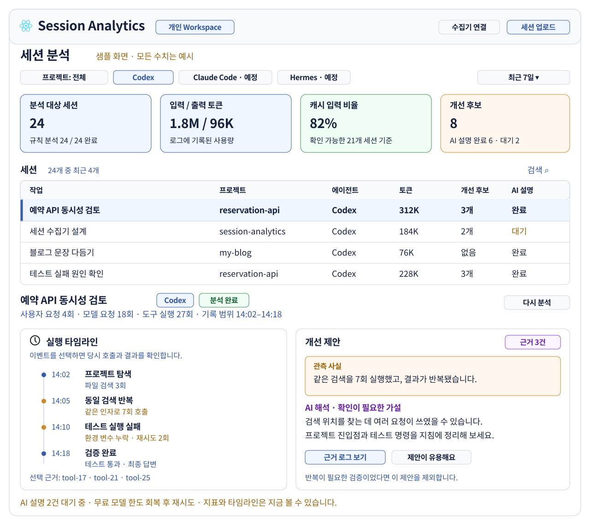

# Atlas

[전체 흐름](README.md) · [Atlas](atlas.md) · [Collector](collector.md)

**세션 보관·분석·조회를 맡는 Next.js 웹 애플리케이션.** 현재 구현·검증 상태는 [전체 문서의 현재 상태](README.md#현재-상태)와 [실제 작업 기록](implementation.md)을 따른다.

## 대시보드

*합성 데이터로 만든 화면 예시. 세션을 선택하면 같은 페이지 아래에 상세 분석을 표시한다.*

**구현 기본값:** 한국어 UI·한국어 AI 설명·다크모드. 설정에서 한국어/English와 라이트/다크/시스템 테마를 선택한다.
현재 SVG는 정보 배치 참고용이며, 색상·폰트·컴포넌트 스타일은 구현 시 다시 설계한다.

차가운 중성색 배경과 절제된 강조색으로 데이터·차트·타임라인의 가독성을 우선한다.
Claude를 연상시키는 따뜻한 베이지·주황 중심 스타일은 피하고, 세부 디자인은 구현 과정에서 결정한다.

## 회원가입·로그인·개인 설정

**비로그인은 단발 업로드, GitHub 로그인 후에는 기록 보관·수집기 연결·개인 설정을 제공한다.** GitHub OAuth와 개인 공간 진입은 Edge에서 확인했다. 전체 UI 경로와 장기 운영은 별도 검증이 필요하다.
**GitHub로 시작하기** 한 경로에서 신규 사용자는 Atlas 계정·개인 Workspace를 만들고, 기존 사용자는 자신의 계정으로 로그인한다. 별도 비밀번호 가입은 두지 않는다. Auth0 같은 별도 인증 서비스는 필수가 아니다.

| 사용자 상태 | 제공할 기능 |
|---|---|
| 비로그인 | 파일 수동 업로드·단발 분석. 임시 cookie 기반 방문자 공간(최대 7일), 크기·횟수 제한 적용 |
| GitHub 로그인 | 저장된 세션·과거 분석 조회·삭제, 수집기 연결·자동 동기화 |
| 설정 → 일반 | 언어: 한국어(기본)/English. 테마: 다크(기본)/라이트/시스템. 비로그인 선택은 기기에, 로그인 후 선택은 계정에 저장하며 새 기기에서도 적용 |
| 로그인 후 설정 → AI | 서비스 기본 모델 또는 개인 BYOK 선택. API endpoint·API key·model·호출 한도 설정, 연결 확인·키 교체·삭제 |
| 로그인 후 설정 → 개인정보 | 민감정보 마스킹 켜기·끄기. 기본값은 **켜짐**. 개인 Workspace의 수동 업로드와 Collector 전송에 공통 적용 |

첫 버전의 완료 기준에는 **신규 가입 → Collector 연결 → 기존 Codex 기록 가져오기 → 지금 분석 → 내 결과 조회**를 포함한다. 사용자가 지금까지 작성한 로컬 기록도 가져올 수 있어야 하며 신규 기록만 지원하는 것으로 완료 처리하지 않는다. 최초 가져오기에서 프로젝트·기간·세션 수·전송량·마스킹 상태를 확인하고 실행한다. 업로드·분석 진행률과 실패·재시도를 표시하며 일일 예약을 기다리지 않고 수동 분석을 시작할 수 있다. npm 게시가 막혀도 검증된 로컬 설치 패키지로 이 흐름을 사용할 수 있게 한다.

기존 기록의 발생 시각과 서버 최초 접수 시각을 구분한다. 오래된 로컬 기록도 최초 가져오기 대상이며, 원격 상세 데이터의 최대 7일 보관은 최초 접수 시점부터 적용한다. 재전송·재분석으로 보관 기한을 연장하지 않는다.

언어 선택은 메뉴·폼·오류·날짜·숫자 표기와 새 AI 설명 생성 언어에 적용한다. 기존 원문과 이미 생성된 분석 결과는 언어 변경만으로 번역하거나 AI를 재호출하지 않는다. 라이트·다크 모두 표·차트·코드·상태 색상의 가독성을 검증하고 최초 로딩 시 저장된 테마를 적용한다.

마스킹을 켜면 서버가 민감정보를 치환한 뒤 저장·분석한다. 끄면 치환하지 않은 내용이 저장되고 외부 AI 분석에 포함될 수 있음을 설정 화면에 표시한다. 비로그인 업로드는 기본 켜짐을 유지한다.
설정 변경은 이후 새로 접수되는 데이터에 적용한다. 이미 저장한 데이터·분석 결과는 자동 변경하지 않으며, 마스킹으로 제거한 정보는 설정을 꺼도 복원되지 않는다. 접수 건별로 적용 여부와 정책 버전을 기록하고 분석 화면에도 마스킹 상태를 표시한다.

BYOK는 **OpenAI 호환 API endpoint·API key·model을 직접 입력**한다. OpenRouter는 endpoint를 채워주는 프리셋이며 다른 OpenAI 호환 제공자도 연결할 수 있다. 비용은 사용자가 연결한 계정에 청구한다. BYOK 실패 시 서비스 키나 다른 유료 모델로 자동 전환하지 않는다.

| BYOK 설정 | 계약 |
|---|---|
| 제공자 | OpenRouter 프리셋 또는 Custom endpoint. 제공자 이름과 API 형식을 분리 |
| API endpoint | API 기본 URL을 입력. `/chat/completions`를 붙여 호출하며 경로 중복을 정규화. 저장 전 최종 호출 주소 표시 |
| API key | 해당 endpoint 전용 개인 키. Bearer 인증, 서버 암호화 보관 |
| Model | 정확한 모델 ID 직접 입력. 모델 목록 API가 없어도 설정 가능 |
| 연결 확인 | 합성 입력으로 인증·모델·텍스트 응답·분석 JSON 계약을 검증하는 저장·UI 경로가 구현되어 있다. 실제 사용자 endpoint·키 연결은 원격 미검증이며 endpoint·키·모델 변경 시 연결 상태를 무효화한다 |
| 호출·비용 | 개인 계정별 동시 호출 기본 1, 실패 시 백오프. 비용을 확인할 수 없으면 `unknown` 표시 |
| API 어댑터 | 초기에는 OpenAI 호환 Chat Completions. Anthropic 고유 API 등 다른 요청·인증 형식은 별도 어댑터로 확장 |

사용자가 입력한 endpoint는 서버 요청 전에 검증한다. 공개 HTTPS 주소만 허용하고 URL 내 인증정보·쿼리·fragment, loopback·사설·link-local·메타데이터 주소와 리디렉션을 차단한다. DNS가 반환한 모든 IPv4·IPv6 주소를 검사하고 검증한 주소로 연결해 DNS 재바인딩을 막는다. 키는 지정 endpoint에만 전달하며 응답·로그에는 남기지 않는다. 이 SSRF 방어와 암호화 저장 경로는 구현되어 있으나 실제 사용자 endpoint·키 연결은 원격 미검증이다.
OpenRouter 전용 가격·Provider·ZDR 옵션을 실제로 라우팅하는 별도 어댑터는 아직 구현 범위가 아니다. Custom endpoint에 같은 보관 정책이나 가격을 보장한다고 표시하지 않으며 연결 설정에 외부 제공자의 데이터 정책과 전송 대상을 표시한다.
개인 키는 서버에서 암호화해 보관하며 암호화 키는 DB와 분리한다. 저장한 키 원문은 조회 API·로그·브라우저 저장소에 남기지 않는다.
자동 분석도 사용자 설정을 따르며, 실행 시 설정 버전을 고정한다. 키 삭제는 이후 호출을 차단한다.

분석 전에는 선택 모델·endpoint 호스트·무료/BYOK·비용 부담 주체·외부 전송 범위를 표시한다.
각 결과에는 **실제 응답 모델 ID·Provider·endpoint 호스트·분석 시각·토큰 사용량·확인 가능한 비용·분석 버전**을 저장하고 표시한다. 비용 미확인은 `unknown`으로 구분한다.
BYOK에도 같은 마스킹 설정과 데이터 정책을 적용하고, 조건에 맞지 않는 모델·Provider는 선택할 수 없게 한다.

## 원격 분석: 자동과 수동

| 기동 방식 | 처리 범위 |
|---|---|
| 시간당 GitHub Actions | Vercel 유지관리 API 호출. `SELECT 1`로 DB 연결 확인·만료 데이터 정리. 새 세션이 없는 날에도 실행 |
| 일일 GitHub Actions | Vercel 분석 기동 API 호출. 인증·실행 구간의 중복 확인 후 Workflow 시작, `202`와 작업 ID 반환 |
| 전체 세션 지금 분석 | 내 Workspace에 접수된 만료 전 전체 세션을 대상으로 즉시 시작. 현재 목록 페이지·하루 범위로 제한하지 않으며 대상 건수를 표시 |
| 선택 세션 분석 | 목록에서 체크한 세션들을 한 작업으로 접수. 프로젝트·기간 필터와 페이지를 넘는 선택 범위를 명확히 표시 |
| 단일 세션 분석 | 세션 상세에서 해당 세션만 즉시 분석. 완료된 세션에는 기존 결과 조회와 명시적 다시 분석을 구분 |
| 공통 Workflow | 일일 실행은 누적 미분석 범위·누락 작업, 수동 실행은 요청한 전체·선택·단일 범위를 사용. **대상 세션·접수된 배치 목록·데이터 revision을 고정**하고 프로젝트별 지표·규칙 결과 → 필요한 AI 설명 순서로 저장 |

전체·선택·단일 수동 분석은 첫 버전 필수 기능이다. API에서 모든 대상의 소유권과 원본 만료 여부를 검사한다. 전체 분석은 세션별 결과와 프로젝트별 종합 지표·개선 후보를 제공한다. 기본 실행은 이미 분석한 변경 없는 세션의 결과를 재사용하고 신규·변경·실패 세션을 처리한다. **다시 분석**은 명시적으로 새 실행을 만들되 버튼 중복 클릭·재시도는 같은 요청으로 처리한다.

작업별 전체·대기·진행·완료·실패 건수와 세션별 결과를 표시하고 완료된 결과부터 볼 수 있게 한다. 브라우저를 닫거나 다시 로그인해도 작업과 결과를 조회할 수 있어야 한다. 수동 실행은 즉시 작업을 접수한다는 뜻이며, AI 호출은 일일 분석과 공유하는 계정 전체 동시성 1 제한을 지킨다. 대기 중에는 대기 상태를 표시한다. 만료된 원본과 요약만 남은 세션은 분석 가능 대상으로 세지 않는다.

일일 흐름은 **Actions → 분석 기동 API → Workflow**다. API는 외부 요청의 진입점이며 분석을 완료할 때까지 기다리지 않는다. 데이터 조회·범위 확정·분석·대기·복구는 Workflow가 맡는다. 수동 실행도 같은 Workflow를 시작한다. [Workflow 시작](https://vercel.com/docs/workflows)
하루치 데이터 전체를 지표·규칙으로 살피되 이미 완료한 동일 revision은 재호출하지 않는다. AI에는 사용자·프로젝트 경계를 지킨 축약 근거만 보내며 하루치 원문 전체를 한 요청에 넣지 않는다.

접수 API는 데이터를 저장하고 분석 필요 상태만 표시한다. 업로드할 때마다 Workflow를 실행하지 않는다.
DB 연결 확인은 테이블을 읽지 않는 `SELECT 1`로 충분하며 `LIMIT`은 필요하지 않다. GitHub Actions가 Vercel API를 호출하므로 사용자 PC 가동 여부와 무관하다. 연결 실패는 기록하고, 처리할 데이터가 없으면 AI를 호출하지 않는다.
Supabase 서울 프로젝트에 시간당 유지관리 작업을 실행한다. 단, 무료 플랜의 자동 중지는 최근 DB 활동량에 따라 결정되므로 주기적 쿼리만으로 중지 방지를 보장하지 않는다. 이미 중지된 프로젝트는 일반 쿼리로 재개되지 않는다. [Supabase 중지 정책](https://supabase.com/docs/guides/platform/free-project-pausing)
같은 세션·revision·분석 버전은 한 번만 등록한다. 분석 버전에는 활성 규칙 목록·각 규칙 버전·임계값 설정의 식별값을 포함하고 실행 시작 시 고정한다. 실행 중 추가·지연 도착한 데이터는 다음 분석 대상이다.

## 분석 지표와 AI 설명

| 코드로 계산 | AI가 해석 |
|---|---|
| 입력·캐시·출력 토큰, 요청·도구 실행 횟수 | 반복 호출이 불필요했을 가능성과 반례 |
| 동일 검색·오류·큰 응답 구간 | 사전에 제공하면 좋았을 맥락 |
| 원본 이벤트 위치와 관측 시간 | 프롬프트·스킬·작업 분할 개선 제안 |

### 개선 후보 규칙의 확장

**규칙이 관측 근거를 가진 개선 후보를 찾고, AI가 맥락·반례·개선 방법을 설명한다.** 후보는 낭비나 잘못된 작업이라는 확정 판정이 아니다. AI 설명이 없어도 규칙 결과는 조회할 수 있다.

| 구성 | 책임 |
|---|---|
| 규칙 모듈 | `apps/web/lib/analysis/rules/`에 규칙별 파일을 둔다. 공통 이벤트·계산된 지표·설정을 받아 후보를 반환하는 순수 함수로 작성. DB·네트워크·AI 호출은 하지 않음 |
| 규칙 계약 | 고유 `id`, `version`, 필요한 입력, 기본 설정, 설정 검증, `evaluate(context, config)`를 정의. 에이전트별 원본 형식 해석은 Source Adapter에 유지 |
| 규칙 목록·설정 | 명시적 목록에서 규칙 등록·제거, 활성화 여부·임계값을 관리. 초기에는 저장소의 설정으로 변경하고 배포. 별도 플러그인 서비스나 사용자 규칙 편집기는 도입하지 않음 |
| 공통 후보 | 규칙 ID·버전, 후보 종류, 관측값·임계값, 근거 이벤트 ID를 반환. 대시보드와 AI는 이 공통 형식만 사용 |
| 실행기 | 활성 규칙을 실행하고 결과를 합친다. 규칙별 `completed`·`skipped`·`failed`를 구분. 입력 부족은 건너뛰고, 한 규칙 실패는 다른 규칙·기본 지표를 막지 않음 |

첫 규칙 후보는 동일 검색 반복, 동일 오류 반복, 큰 도구 응답이다. 규칙 isolation과 `appliedRules`의 규칙 ID·버전 기록을 구현했다. 횟수·크기·관측 구간은 규칙별 설정으로 둔다. 합성 데이터로 정상적인 반복 작업과 입력 누락을 확인한 뒤 활성화한다.
규칙 추가는 모듈·목록 등록·합성 검증 사례 추가로 끝나도록 한다. 제거는 목록에서 빼거나 비활성화하며, Collector·접수 API·화면의 개별 수정 없이 반영한다. 새로운 입력이 필요할 때만 공통 이벤트 계약을 호환 가능하게 확장한다.
기존 결과에는 당시 규칙·설정 버전을 남기고 새 규칙으로 덮어쓰지 않는다. 재분석은 새 버전으로 실행하되 상세 데이터 7일·간단한 요약 30일의 만료를 연장하지 않는다. 검증 사례에는 탐지 성공, 임계값 경계, 정상 작업의 오탐 방지, 입력 부족, 규칙 비활성화·실패 격리를 포함한다.

## AI 실행 선택

| 방식 | 실행 위치 | 판단 |
|---|---|---|
| **Z.ai `glm-4.7-flash`** | Workflow의 AI 단계 → Z.ai 직접 API | **기본안.** 입출력 무료 모델을 고정하며 키·한도·분석 품질 검증 후 활성화 |
| 개인 BYOK | Workflow → 사용자 설정 API endpoint | OpenRouter 프리셋 + Custom OpenAI 호환 API. endpoint·키·모델 직접 설정, 기본 서비스 키로 자동 대체하지 않음 |
| 개인 Codex Runner | 본인 PC → OpenAI → 결과를 서버에 업로드 | 기존 플랜 활용 대안. PC 가동·플랜 한도 필요. 공유 서비스 기본 자격증명으로 쓰지 않음 |
| 직접 모델 호스팅 | 원격 CPU·GPU 서버 | 데이터 통제가 필요하거나 처리량이 늘면 검토. 초기 운영 범위에서는 제외 |

`codex exec`는 기존 CLI 인증을 재사용할 수 있다. 로컬 실행이어도 추론 입력은 OpenAI에 전달된다.  
구독이 불특정 사용자용 API 사용권을 뜻하지는 않는다. [Codex 공식 문서](https://learn.chatgpt.com/docs/non-interactive-mode)

| 무료 AI 운영 규칙 | 제안 |
|---|---|
| 모델 선택 | 기본 `glm-4.7-flash`를 Z.ai 직접 호출. `glm-4.7`·`glm-4.7-flashx` 등 유료 모델 자동 대체 금지. 합성 세션으로 품질 기준 검증 |
| 품질 평가 | 근거와 결론의 일치, 중요한 문제 발견, 정상 작업을 문제로 오판하지 않는지, 실행 가능한 개선 제안, 한국어 설명·JSON 계약 준수 순으로 평가. 속도는 품질이 비슷할 때만 비교 |
| 입력 | 전체 로그 대신 지표 + 최대 5개 근거 구간. 입력 약 8K·출력 1.5K tokens 상한 |
| 호출량 | 운영 동시 호출은 1개로 고정. 수동·일일 분석이 서비스 계정의 같은 슬롯을 공유하며, 완료되면 바로 다음 요청 실행. 성공 뒤 고정 대기 없음. 일일 자체 예산은 계정 한도·품질 평가 후 정함 |
| 외부 한도 | Z.ai 동시 호출 3은 사용자 확인값. 실제 3개 병렬 응답과 기타 호출 한도는 별도 검증. 일일 무제한으로 가정하지 않음. OpenRouter의 20회/분·50회/일은 Z.ai에 적용하지 않음 |
| 무료·데이터 조건 | Z.ai 모델 ID·가격·API 전용 데이터 조건 검증. OpenRouter 전용 `max_price`·`data_collection`·`zdr` 옵션을 Z.ai 요청에 보내지 않음 |
| 일시 실패 | Z.ai 1302(동시성)·1303(빈도)·1304(일일 한도)·1305(호출 제한)를 구분. 429·503·일시적 5xx·네트워크 실패는 총 최대 5회·최대 72시간 동안 300 → 1,800 → 7,200 → 21,600초 백오프와 jitter로 재시도. `Retry-After`나 한도 갱신 시각이 더 늦으면 그 시각까지 대기. 성공 뒤 고정 대기는 없다 |
| 한도·조건 대기 | 일일 한도 소진은 알려진 갱신 시각까지 보류하고 재호출하지 않음. 계정 제한이면 계정 전체, Provider 과부하면 해당 Provider에 공통 대기를 적용. 정책에 맞는 Provider가 없어도 대기. 다음 시도 시각·사유 표시, 정책 완화·유료 대체 없음 |
| 대기 방식 | Workflow의 durable sleep으로 재개 시각을 기록. 함수 안의 긴 sleep·HTTP 연결 유지 금지. 계정 공통 동시 슬롯·최근 60초 요청 수·일일 예산은 DB에서 원자적으로 확보하고 수동 분석도 같은 제한 적용. 대기 중에는 동시 슬롯 해제 |
| 실패 종료 | 작업당 최대 5회 실제 호출 또는 72시간 경과 시 실패. 원본 만료가 먼저 오면 즉시 중단. 인증·잘못된 요청 등 영구 오류는 즉시 종료. 기본 지표 유지·수동 재분석 제공 |
| 실행 정책 | 한 번에 1개씩 처리. 성공 후 병렬 수 자동 증가 없음. 실패한 요청은 백오프 후 재시도 |
| 결과 검증 | JSON 형식·근거 ID 검사. 근거 없는 결론은 게시하지 않음. 모델에 도구 실행 권한 없음 |

무료 모델과 데이터 정책을 동시에 만족하는 Provider가 없으면 설명 생성은 보류한다.  
실제 모델·한도는 배포 시 재확인하고, 20개 합성 세션으로 설명의 유용성을 평가한다. [Z.ai 가격](https://docs.z.ai/guides/overview/pricing) · [계정별 동시성](https://docs.z.ai/guides/overview/concept-param)
분석은 비동기로 진행하며 응답 속도를 이유로 낮은 품질의 모델로 자동 전환하지 않는다.
입력·출력 토큰 상한과 요청 timeout은 초기 운영값이다. 추론·응답 잘림과 근거 누락을 평가해 플랫폼·비용 한도 안에서 조정한다.

### 비동기 호출과 Batch API

2026-09-11 공식 문서에서 OpenRouter Batch API 베타를 확인했다. `POST /api/beta/batches`로 제출하고 상태를 조회하며 완료 구간은 24시간이다. 일반적으로 토큰 요금은 표준 가격의 50%지만 무료 모델 지원을 뜻하지는 않는다.
입력과 결과를 생성 후 30일 보관하므로 현재 상세 데이터 7일·ZDR 조건에 맞지 않는다. 기본 경로는 일반 API를 Workflow에서 한 번에 1개씩·실패 시 백오프로 호출하는 방식이다. 향후 Batch 지원은 모델·Provider의 지원, 비용, 보관·삭제 조건을 확인한 뒤 별도로 결정한다. [Batch API](https://openrouter.ai/docs/batch-quickstart) · [호출 한도](https://openrouter.ai/docs/api_reference/limits) · [오류와 Retry-After](https://openrouter.ai/docs/api_reference/errors-and-debugging)

Z.ai는 일반 API `https://api.z.ai/api/paas/v4/chat/completions`를 사용한다. 서비스 키는 서버 전용 `ZAI_API_KEY`이며 Coding Plan 전용 엔드포인트는 사용하지 않는다. [HTTP API](https://docs.z.ai/guides/develop/http/introduction)

### 모델 검증 상태

2026-09-11 기본 모델을 Z.ai `glm-4.7-flash`로 변경했다. 공식 가격표의 무료 표기와 API 전용 약관의 입력·출력 미보관 조건을 확인했다. 키 입력 후 합성 요청 3개를 동시에 전송했으나 모두 HTTP 429·코드 1305로 거절됐다. Retry-After 헤더는 없었다. 이후 사용자 요청으로 예정된 5분 재시도를 취소하고 단일 요청을 보냈다. HTTP 200·13.1초, 실제 모델 glm-4.7-flash, JSON 형식·근거 ID·한국어 응답 검사를 통과했다. 단일 합성 사례의 연결 성공이며 전체 분석 품질이나 병렬 실패 원인의 확정을 뜻하지 않는다. 결과는 `ops/zai-verification.json`·`ops/zai-verification-single.json`에 기록했다. 추가로 합성 요청 2개를 동시에 보내 모두 HTTP 200(11.5초·13.9초), JSON·근거 ID 기본 검사를 통과했다. 결과는 `ops/zai-verification-pair.json`에 기록했다. 표현의 정확성 등 전체 품질 평가는 별도다. 사용자 확인 동시성 3과 실측 호출 성공을 구분한다. [API 데이터 조건](https://docs.z.ai/legal-agreement/privacy-policy#4-data-return-and-deletion)

이전 OpenRouter 연결 시험에서는 공개 모델·ZDR 목록 조회에서 `inclusionai/ling-3.0-flash-vl:free`의 Novita endpoint를 가용성 후보로 확인했다.
입력·출력 가격 0과 ZDR 목록 등재를 확인한 것이며, 성능 우위나 운영 기본값을 뜻하지 않는다. 이후 합성 입력 연결 시험에서 해당 모델·Provider 응답과 비용 0을 확인했다. 실제 분석의 JSON 계약·근거 정확도·한국어 설명 품질은 미검증이다.
운영 모델은 배포 시 후보 목록을 갱신하고 위 품질 평가로 선정한다. 무료 후보가 품질 기준에 못 미치면 기본 지표만 제공하고 AI 설명은 미제공 상태와 사유를 표시한다. 로그인 사용자는 BYOK 모델을 선택할 수 있다.
[모델 API](https://openrouter.ai/api/v1/models) · [ZDR endpoint 목록](https://openrouter.ai/api/v1/endpoints/zdr) · [ZDR 정책](https://openrouter.ai/docs/guides/features/zdr)

## 배포: Vercel 중심으로 통합

**GitHub org public 저장소를 본인의 Vercel Hobby에 연결한다.**  
Supabase 서울 프로젝트의 DB·비공개 Storage를 사용하고, Vercel 함수도 서울 `icn1`로 고정한다. GitHub Actions와 외부 AI API의 실행 위치는 별도다.

GitHub OAuth Homepage URL은 `https://agent-session-atlas.vercel.app`, callback은 `https://agent-session-atlas.vercel.app/api/auth/callback/github`로 등록한다.
GitHub OAuth callback, 세션·기기·설정·분석 API, Workflow 시작 경로는 저장소에 구현되어 있다. 운영 URL 배포와 실제 OAuth 진입은 확인했지만, npm 공개와 예약 작업의 원격 실행은 아직 확인하지 않았다.

| 구성요소 | 어디에 배포하나 | 무료 범위·설계 선택 |
|---|---|---|
| Web · API | Vercel 서울 `icn1`의 Next.js 프로젝트 | `*.vercel.app`·HTTPS. 별도 VM·도메인 구매 불필요 |
| 분석 실행 | Vercel Workflow + Functions | 함수 최대 300초(Fluid Compute). 단계마다 240초 안에 종료·진행 위치 저장 |
| 원본 파일 | **Supabase 비공개 Storage**, 서울 | 무료 저장 1 GB. 공개 버킷 사용 금지 |
| PostgreSQL | **Supabase Free**, 서울 | DB 500 MB. 일반 API 요청 횟수 무제한. 7일간 활동 부족 시 프로젝트 일시 중지 가능 |
| AI | Z.ai `glm-4.7-flash` / OpenAI 호환 BYOK | 외부 호출 허용 시에만 실행. 계정 단위 일일 예산 검사 |
| 원격 예약 작업 | GitHub Actions | 시간당 DB 확인·만료 정리, 일일 분석 기동. Vercel은 인증된 API·Workflow 실행을 담당 |
| 로그인 | 앱 내부 인증 + GitHub OAuth | 첫 로그인에서 계정·개인 Workspace 생성. 수집기는 폐기 가능한 전송 토큰 사용 |

2026-09-11 공식 문서 확인 기준이다. **Hobby는 개인 비상업 용도**이며 회사 업무·팀 서비스는 플랜을 재검토한다.  
무료 할당은 무기한 가동 보장이 아니다. 한도를 넘으면 기능이 중단될 수 있고 유료 전환은 별도 결정한다.

### 인프라 관리: 설정 파일 + 스크립트

**초기에는 Terraform 없이 설정 파일·TypeScript 스크립트·GitHub Actions로 관리한다.**  
리소스 수가 적으므로 Vercel CLI/API를 감싼 스크립트로 시작한다. `ops/production.json`과 루트 `vercel.json`은 현재 리소스·서울 리전 설정을 기록한다. 웹·API·Workflow 경로는 구현되어 있고, 예약 작업의 원격 실행과 운영 반복 검증은 남아 있다.

| 관리 대상 | 코드로 관리할 위치·방식 |
|---|---|
| Vercel 프로젝트 | `ops/production.json`에 이름·리전·`apps/web` 경로·리소스 ID. `scripts/infra.ts`로 조회·생성·연결 |
| 비공개 Storage | Supabase Storage API로 버킷 조회·생성. `public: false`와 JSON·최대 파일 크기 제한 확인 |
| Supabase | Marketplace로 Free·서울 프로젝트 연결. 프로젝트 ID·리전 기록. SQL migration으로 스키마 관리. 서버리스는 transaction pooler, 마이그레이션은 direct 또는 session pooler 사용. 공식 CA `ops/certs/supabase-prod-ca-2021.crt`로 TLS 인증서 검증 유지 |
| 예약 작업 | `.github/workflows/maintenance.yml`·`analysis-daily.yml`에 일정·수동 실행·동시 실행 제한. Vercel의 `/api/jobs/maintenance`·`/api/jobs/analysis`를 호출 |
| Workflow | `workflows/*.ts`의 `use workflow`·`use step`, `next.config.ts`의 `withWorkflow`. Next.js와 함께 배포. 서울 상태 저장은 SDK `5.0.0-beta.33` 이상에서 지원하므로 설치 버전·실제 실행 리전 확인 |
| 환경변수 | `.env.example`에 이름만 기록. 실제 키는 Vercel 환경변수·GitHub Secrets, CLI 기기 토큰과 분리 |
| 웹 배포 | Actions에서 검사 → DB migration → Vercel CLI 배포 → 원격 smoke test |
| CLI 배포 | CLI 태그 → 빌드·패키지 설치 검사 → npm 공개 게시. 최초 게시 후 npm Trusted Publishing 연결 |

운영 배포는 Actions로 통일하고 Vercel Git 자동 배포와 중복 실행하지 않는다. PR Preview도 별도 환경으로 배포한다.  
Vercel은 `apps/web`만 배포하되 `packages/contracts`를 빌드에 포함한다. 수집기는 Vercel 배포 대상에서 제외한다.

유지관리 API는 Next.js 앱 안의 작은 엔드포인트이며 별도 서비스로 배포하지 않는다.
원격 예약 작업은 GitHub Actions로 통일하고 `vercel.json`에는 Cron 일정을 등록하지 않는다. 아래는 구현할 일정이다.

| 작업 | GitHub Actions 일정(UTC) | 실행 범위 |
|---|---|---|
| 유지관리 | `17 * * * *` | 매시 17분에 DB 연결 확인·만료 데이터 정리. 외부 AI 호출 없음 |
| 일일 분석 | `37 18 * * *` | 한국 시간 다음 날 03:37에 누락 작업 복구·신규 분석 등록 |
| 수동 복구 | `workflow_dispatch` | 동일 작업을 운영자가 재실행. 대시보드 수동 분석도 같은 분석 실행기를 사용 |

일정은 정시 실행을 보장하지 않는다. Actions는 짧은 인증 HTTP 요청만 보내고, 분석은 Vercel Workflow가 이어서 실행한다. API 접수 성공과 분석 완료 상태를 구분한다.
호출용 `SCHEDULER_SECRET`은 GitHub Actions의 운영 Secrets와 Vercel 서버 환경변수에만 저장한다. Actions에는 DB·사용자 세션·AI 키를 전달하지 않는다. API는 인증 후 고정된 작업만 실행하며 임의 SQL·URL을 받지 않는다.
워크플로별 `concurrency`와 제한된 재시도·timeout을 두고, 서버에서도 작업 종류·예정 실행 구간을 유일 키로 사용해 재호출을 중복 처리하지 않는다. 분석은 기존 session·revision·분석 버전의 멱등성을 추가로 적용한다. 누락된 정리·분석 범위는 다음 실행에서 복구한다. 만료 데이터는 정리 실행 지연과 무관하게 조회에서 제외한다.
공개 저장소의 기본 GitHub 호스팅 실행기는 무료다. 예약 실행은 지연·누락될 수 있고, 저장소 활동이 60일 없으면 비활성화될 수 있다. 운영 화면에 마지막 성공 시각·실패·지연 상태를 표시하고 수동 복구 경로를 제공한다. [예약 실행 제약](https://docs.github.com/en/actions/reference/workflows-and-actions/events-that-trigger-workflows#schedule) · [사용 요금](https://docs.github.com/en/actions/concepts/billing-and-usage)

| 운영 명령 제안 | 책임 |
|---|---|
| `pnpm infra:plan` / `pnpm infra:apply` | 현재 리소스와 설정 비교 / 없는 리소스 생성·연결. 반복 실행 가능하며 자동 삭제 없음 |
| `pnpm db:migrate` | 버전이 있는 SQL을 한 번만 적용. 웹 배포보다 먼저 실행 |
| `pnpm deploy:preview` / `pnpm deploy:prod` | 지정 환경 빌드·배포. 운영 키를 PR Preview에 전달하지 않음 |
| `pnpm smoke:remote` | 합성 세션 접수·중복 ACK·수동 분석·조회·삭제까지 확인 |

계정 가입·OAuth/Marketplace 동의·최초 npm 게시와 신뢰 연결은 초기 수동 절차로 기록한다.  
그 이후 반복 운영을 스크립트로 재현한다. `infra:plan`은 자체 비교 명령이며 Terraform 수준의 상태 관리까지 구현하지 않는다.

팀·환경이 늘어 리소스 변경 추적이 복잡해지면 Terraform을 도입한다. 그때도 분석 코드·SQL·CLI 설치 코드는 각각 유지한다.

### 무료 운영 범위

| 항목 | MVP에서 적용할 상한 |
|---|---|
| 원본 | 마스킹 설정을 적용한 세션 JSON 파일은 최초 접수부터 **최대 7일** 보관 후 삭제. 마스킹 여부·로그인 여부와 무관하게 같은 최대 기간 적용. 전체 파일 **700 MB**에서 새 전송 중지하고 로컬 대기. 실제 저장 바이트로 제한 |
| 크기 예산 | 하루 신규 기록 총 40 MB 가정 시 7일 약 280 MB. 세션 전체 재전송 없이 추가분만 전송 |
| 파일 요청 | 30분마다 목적지별 변경분 전송. 목적지 1개·실행당 1배치·월 30일 가정 시 하루 4시간 변경은 월 약 240회, 8시간은 480회 업로드. 크기 제한에 따른 분할·재시도는 별도 |
| DB | 지표·메타데이터·근거 위치 위주. 전체 도구 출력은 비공개 Storage에 두고 DB 350 MB에서 신규 입력 제한 |
| 함수 | Hobby 4 CPU-hours·360 GB-hours/월. 대기에도 메모리 시간이 잡히므로 긴 대기는 Workflow로 넘김 |
| Workflow | 월 50,000 events·기록 1 GB, 내부 Queues 월 100만 operations 무료 범위까지 함께 확인 |
| 상세 결과 | 상세 이벤트·세션별 지표·전체 분석 결과·근거는 **최대 7일** 보관·제공 |
| 결과 요약 | 짧은 결론과 집계 지표만 **최대 30일** 보관·제공. 원문·도구 출력·상세 근거·전체 AI 응답은 포함하지 않음 |
| 관측 | 분석 Workflow 시작 시 `experimental_retention: 0`을 사용해 실행 기록을 즉시 정리. 제품 결과는 Supabase DB에 저장하되 세션 보관 정책을 적용. 로그에 세션 내용·분석 결과를 복제하지 않음 |

Supabase의 500 MB 제한은 DB 용량이며, 세션 본문 파일은 별도 비공개 Storage에 저장한다. 무료 비캐시 전송량은 월 5 GB이며 DB·Storage 사용량을 함께 확인한다. [요금](https://supabase.com/pricing)
원격 데이터의 보관 기준은 최초 접수 시각이다. 상세 데이터·세션 메타데이터·배치 접수증·전체 분석 결과는 이 시각부터 7일, 결과 요약은 30일에 만료한다. 유지관리 작업은 7일이 지난 상세 데이터와 오래된 Storage 객체를 정리하고, 1시간 넘은 orphan Storage 객체를 DB와 대조해 정리한다. DB 사용량이 350 MiB에 도달하면 새 입력을 막는다. 중복 전송·재분석·혼합 배치 재작성으로 만료 시각을 연장하지 않는다. 여러 기록을 묶은 결과는 포함된 기록 중 가장 이른 만료 시각을 따른다.
만료된 데이터는 삭제하며 조회·검색·다운로드·재분석에서도 제공하지 않는다. 7일이 지나면 간단한 결과 요약만 볼 수 있고, 30일이 지나면 요약도 삭제한다. 비로그인·로그인 모두 같은 최대 기간을 적용한다.
보관 기간 연장은 향후 유료 플랜이나 사내 운영 환경에서 다룬다. 현재 MVP에는 기간 연장 설정을 제공하지 않는다.
계정·인증·설정과 계정 자격증명은 세션·분석 이력과 구분해 보관하며, 세션 데이터의 7일·30일 보관 정책에 포함하지 않는다. 재전송 방지용 접수 정보는 배치 접수증 정리 시 함께 삭제되며, 모든 접수증이 삭제된 뒤 같은 원본을 보내면 새 import로 처리한다. 같은 기존 레코드의 재전송·재분석은 TTL을 연장하지 않는다. 로컬 에이전트 원본과 미접수 Outbox의 삭제 정책은 [Collector](collector.md#30분-전송과-장애-복구)를 따른다.

재시도·분할·목록 조회·세션 삭제를 위한 객체 재작성도 요청량에 포함한다. 무료 한도 부족 시 대기·주기 조정·플랜 변경 중 선택한다.
같은 계정의 다른 프로젝트 사용량과 Preview도 예산에 포함한다. 함수·Storage 전송량은 무료 사용량 화면에서 함께 확인한다.  
상한의 80%에서 화면에 알리고, 한도에 닿기 전에 새 입력·AI 재시도를 멈춘다.

### 비동기 실행과 배포 완료 조건

| 단계 | 구현·확인할 내용 |
|---|---|
| 업로드 | 로컬·브라우저 → Next.js에 JSON POST. 서버가 Workspace의 마스킹 설정을 적용한 뒤 서버 자격증명으로 Supabase Storage에 저장 |
| 접수 | 설정을 적용한 객체 저장 후 배치·세션 변경 정보를 Supabase DB에 COMMIT하고 ACK. 분석은 Actions·수동 API가 별도 등록 |
| 규칙 분석 | 확정한 배치 목록의 JSON을 읽어 지표·근거 위치 저장. 배치 크기를 제한해 단계별 처리 |
| AI 설명 | 근거만 읽어 호출·검증·저장. 120초 요청 timeout, 지연은 Workflow sleep 후 재개. 브라우저 종료와 무관 |
| 운영 배포 | org public 연결 → Supabase DB·Supabase Storage 생성 → 환경변수 설정 → 마이그레이션 → Vercel 운영 배포. DB와 함수는 같은 리전 우선 |
| 배포 검증 | 30분 전송·수동/일일 분석·조회·삭제 확인. 서버 장애와 ACK 유실 후 재전송해도 중복 없는지 검증 |
| 재배포 | PR Preview는 합성 데이터·별도 DB/Storage. 운영 자격증명을 전달하지 않고 CI 통과 후 main 병합 |
| 복구 | 배포 전 DB export, 이전 앱 버전과 호환되는 마이그레이션. 앱 rollback과 DB 복원은 별도로 검증 |

Functions의 **4.5 MB 본문 제한** 안에서 동작하도록, MVP는 JSON 요청 전체를 **1 MiB** 이하로 제한한다.
큰 입력은 이벤트 경계로 배치를 나누며, 단일 이벤트도 초과하면 조용히 자르지 않고 격리·표시한다.  
Workflow에는 ID·진행 위치만 넘기고, 파일 내용이나 전체 모델 응답을 실행 기록에 중복 저장하지 않는다.

[데이터 경계](README.md#데이터-경계) · [참고 자료](README.md#참고-자료)

DB CA 출처: [Supabase 공식 인증서](https://supabase-downloads.s3-ap-southeast-1.amazonaws.com/prod/ssl/prod-ca-2021.crt). [Workflow 리전·버전 제약](https://vercel.com/docs/workflows#version-and-migration).
