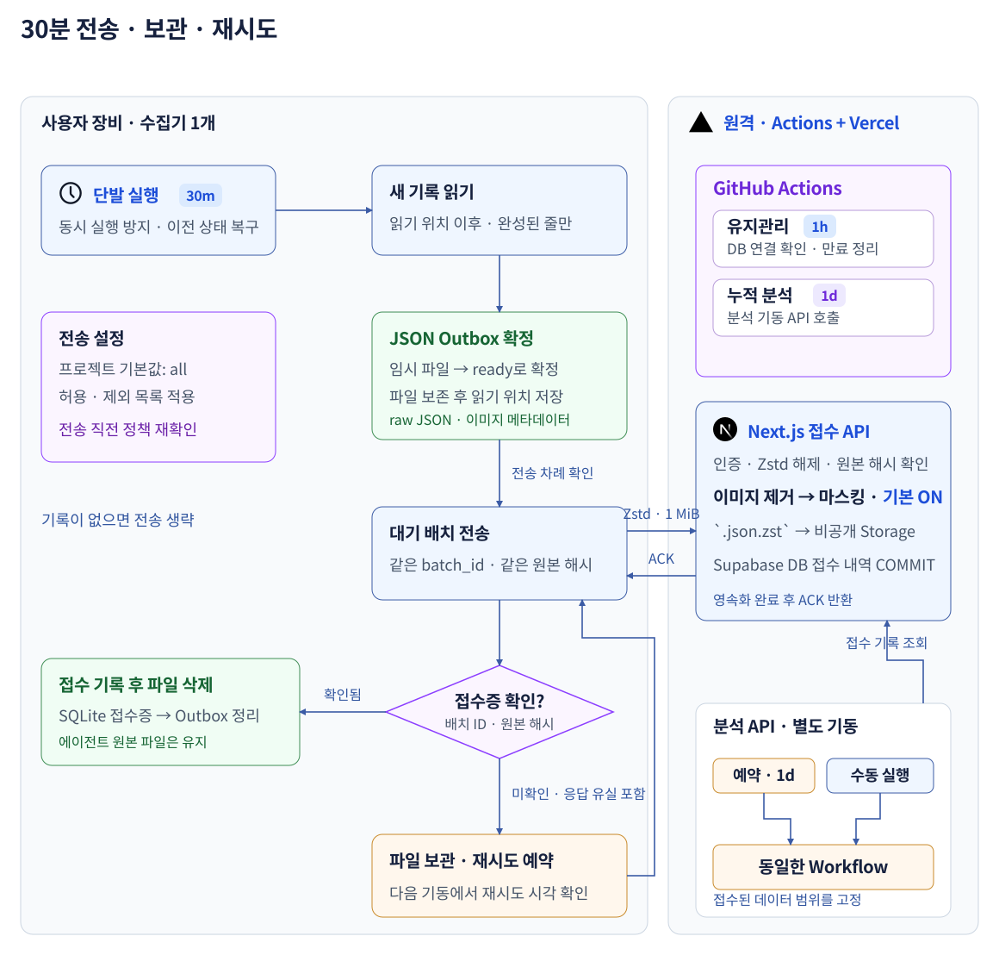

# Atlas Collector



[전체 흐름](README.md) · [Atlas](atlas.md) · [Collector](collector.md)

**Codex 기록을 수집해 Atlas로 보내는 TypeScript 기반 Node.js CLI.** Collector 0.1.0과 증분 수집·JSON Outbox·ACK 재시도·macOS launchd 경로가 구현되어 있다. [GitHub Release](https://github.com/agent-observatory/agent-session-atlas/releases/tag/collector-v0.1.0)에서 tarball 설치를 확인했으며, npm 게시와 실제 개인 자동 수집은 아직 완료하지 않았다.

## 사용자 설치: npx setup

**Node.js 지원 LTS와 npm이 설치된 macOS부터 지원한다.** Windows·Linux 스케줄러는 후속으로 둔다.  
공개 npm 패키지는 아직 게시되지 않았으므로 아래 명령은 예정 공개 설치 경로다. 현재 검증은 로컬 tarball과 설치된 `~/.agent-session-atlas/current/cli.js`로 수행했다.

```sh
npx @agent-observatory/collector@0.1.0 setup
```

`npx`는 게시 후 패키지를 받아 실행하는 진입점이다. **영구 설치와 자동 실행 등록은 `setup`에 구현되어 있으며 로컬 설치에서 확인했다.**

| 단계 | setup이 하는 일 |
|---|---|
| 설치 | 배포 버전을 앱 전용 폴더에 설치. npm 임시 캐시와 분리하고 관리자 권한 없이 사용자 영역에 설치 |
| 계정 연결 | 브라우저 로그인 후 일회용 코드로 기기 연결. CLI에는 해당 Workspace 전송·접수 조회용 토큰만 발급 |
| 수집 설정 | 기본 `all`, 제외 프로젝트·목적지를 보여주고 설정 저장. 연결·설정 완료 후 자동 전송 시작 |
| 자동 기동 | `launchd` 사용자 LaunchAgent 하나에 1,800초 간격 등록. Node·설치 CLI의 절대 경로 사용 |
| 확인 | 시험 연결과 스케줄러 상태 확인. 대기 배치 수·최근 ACK·다음 재시도 시각 표시 |

최초 연결에서는 **기존 기록 가져오기**를 제공한다. 현재 CLI는 `configure --include/--exclude/--since/--until`로 프로젝트·기간을 선택하고, `inventory`로 선택 범위의 세션 수·바이트·프로젝트 수를 집계한다. 대화형 GUI 미리보기는 아직 제공하지 않는다. 로컬 접수 이력이 없으면 서버 접수 내역을 먼저 조회해 이미 보낸 범위를 제외하고, 진행 위치를 저장해 중단 후 이어간다. 가져오기 완료 후 웹에서 **지금 분석**으로 바로 분석할 수 있으며 이후에는 30분 증분 동기화로 이어진다.

30분마다 `npx …@latest`를 실행하지 않는다. **로컬에 설치된 고정 버전**을 실행해야 네트워크 장애에도 기동할 수 있다.  
MVP는 설치된 Node를 사용하며, Node 경로가 바뀌면 `doctor`로 감지하고 `setup` 재실행으로 등록을 복구한다.

| CLI 명령 제안 | 동작 |
|---|---|
| `status` / `doctor` | 전송 상태 조회 / 인증·Node 경로·스케줄러·디스크 진단 |
| `sync` | 즉시 한 번 전송. 원격 AI 분석은 대시보드에서 별도 기동 |
| `pause` / `resume` | 로컬 자동 전송 일시 중지·재개 |
| `update` | 새 버전 설치·검사 후 실행 경로 교체. 실패하면 기존 버전 유지, Outbox·설정 보존 |
| `uninstall` | 스케줄러·프로그램 제거. 미접수 기록·설정은 기본 보존하고 명시적 삭제에서만 제거 |

`setup` 재실행은 등록을 복구하며 중복 LaunchAgent를 만들지 않는다. 기기 토큰은 macOS Keychain에 보관한다.  
npm 계정·게시 권한은 운영자만 필요하다. 사용자는 공개 패키지 설치에 npm 로그인이 필요하지 않다.

## 첫 사용

현재 설치본은 계정 연결 후 자동 전송이 일시 중지된 상태다. `inventory`로 범위와 용량을 확인하고, 필요하면 `configure --include/--exclude/--since/--until`로 범위를 정한 뒤 `sync`를 직접 실행한다. 웹에서 **전체 세션 지금 분석**을 눌러 분석을 시작할 수 있다. `resume`을 실행하면 30분 주기 자동 전송을 다시 켠다.

## 수집과 전송

**Collector는 분석 근거를 선별·정규화해 전송하고, 평가와 AI 해석은 서버가 맡는다.** 현재는 기본 이벤트 변환과 증분 전송이 구현되어 있으며, 아래 정교한 수집 정책은 다음 개발 과제다.
컴퓨터당 OS 스케줄러 하나가 수집기를 30분마다 실행한다. macOS는 `launchd`를 사용한다.
Codex 기록 저장소에서 신규·변경 기록을 찾고 작업 경로로 프로젝트를 분류한다. 프로젝트마다 스케줄러를 등록하지 않는다.

본문·도구 입출력을 확보하기 위해 세션 파일을 읽는 방식을 기본으로 한다.
내장 OTel은 에이전트별 내용·잘림 범위가 달라 후속 보완 경로로 둔다.

```yaml
# 이 서비스의 로컬 전송기 설정 제안
sources:
  codex: { enabled: true, home: "~/.codex" }
  claude_code: { enabled: false } # 후속 어댑터
  hermes: { enabled: false }

collection:
  projects:
    mode: all # all | allowlist
    include: []
    exclude: ["~/work/company/**"]

upload:
  mode: automatic # automatic | manual
  interval_minutes: 30
  workspace: personal
  format: json
  max_request_bytes: 1048576 # 직렬화한 HTTP 본문 1 MiB
  compression: none
  outbox_dir: "~/.agent-session-atlas/outbox"
  max_pending_mb: 1024
  retry_backoff_minutes: [5, 10, 20, 40, 60]

analysis:
  schedule: daily # 원격 하루 1회. 대시보드 수동 실행도 제공
  external_ai: true
```

| 선택 범위 | 규칙 |
|---|---|
| 프로젝트 | `exclude` 우선. 정규화한 경로로 비교하고 경로 미상은 자동 전송 제외 |
| 자동·수동 전송 | 기본은 설정 범위의 새 기록 자동 전송. `manual`은 선택 시점까지의 기록만 대기열에 등록 |
| 본문 | 현재 사용자·에이전트 메시지의 텍스트와 도구 입출력을 변환. 인증 파일이나 프로젝트 소스 전체를 별도로 탐색하지 않음. 사용자 이미지 블록은 제외하지만 도구 출력 내부 이미지의 일관된 제거·분리는 아직 보장하지 않음 |
| 마스킹 | **Next.js 서버에서 기본 `enabled: true`**. Atlas의 Settings → Privacy에서 켜기·끄기. 서버가 인증된 Workspace의 설정을 읽어 새 접수에 적용하며, Collector 요청값으로 해제할 수 없음 |
| 설정 변경 | 실제 전송 직전 정책을 다시 검사. 제외된 미전송 기록은 차단하며, 이미 서버에 보낸 기록은 별도 삭제 |
| 목적지 | 대기 파일에 Workspace·계정·기기·정책 버전을 고정. 설정을 바꿔도 기존 파일의 목적지는 바뀌지 않음 |

프로젝트 경로는 전송 대상을 고르는 기준이며, 붙여넣은 내용까지 개인 데이터라고 판별하지는 않는다.
브라우저 파일 업로드도 같은 서버 수신·마스킹 경로를 사용한다.
로컬 대기 파일과 HTTPS 요청에는 원본 본문이 포함된다. 마스킹이 켜져 있으면 치환 후 Storage·DB에 저장하고, 꺼져 있으면 치환 없이 저장한다. 두 경우 모두 본문을 서버 로그·Workflow 실행 기록에 남기지 않는다.

## 근거를 보존하는 수집

**사용자 지시 → 스킬·도구 사용 → 결과 → 추가 지시·수정의 연결을 보존한다.** 아래는 목표 계약이며, 현재 Collector 0.1.0의 구현 완료 목록이 아니다. Collector는 원본 형식 해석·기계적인 정규화·중복 구분을 맡는다. 마스킹과 분석용 근거 선별·축약은 서버의 공통 경로에서 처리하며, 매 수집마다 로컬 AI 호출을 요구하지 않는다.

| 기록 | 목표 처리 |
|---|---|
| 프롬프트·추가 지시 | 평가 대상 원문과 턴 순서를 보존. 이벤트·턴 단위로 묶어 압축하고, 전송·처리 한도를 넘을 때만 분할. 누락이 생기면 범위를 표시 |
| 스킬·도구 사용 | 명시적 호출·읽기 근거, 인자, 호출 ID, 결과·오류·후속 수정을 연결. 스킬 이름의 단순 언급을 사용으로 확정하지 않음 |
| 큰 도구 출력·코드 | 원문·전체 길이·종료 상태·호출 연결을 보존해 압축 전송. 분석용 변경 요약·발췌는 서버에서 만들고, 동일 출력의 중복 표현은 출처를 유지한 참조로 전달 |
| 중복 이벤트 | 원본 ID·호출 ID·출처를 기준으로 같은 실행의 여러 표현을 구분. 내용이 같아도 실제로 반복한 호출·지시는 별도 발생으로 유지 |
| 사용량 | 누적·요청별 토큰을 구분하고 증분 집계. 모델·턴 경계와 누적값 초기화를 보존해 중복 합산 방지 |
| 복원용 기록 | 암호화된 추론 데이터·복원용 중복 이력은 전송 제외. 압축 발생·맥락 손실 여부 등 분석에 필요한 메타데이터는 보존 |
| 이미지 | 출처 턴·해시·원본 크기·형식을 기록하고 같은 파일은 재사용. 원본은 로컬에 두고 전송용 사본만 축소. 긴 변 1,600px은 실험 시작값이며 글자 가독성 검증 후 확정 |
| 알 수 없는 형식 | 해석 불가·미지원·잘림·정책 제외를 구분해 기록. 수집되지 않은 것을 사용하지 않은 것으로 판단하지 않음 |

전송 계약에는 원본 위치·이벤트 ID와 정제 정책 버전, 원본/전송 바이트, 제외·축약 사유 및 범위를 추가한다. 정책은 단계별 모듈과 등록 목록으로 확장하고 공통 계약 버전을 관리한다. 계약을 바꿀 때는 서버와 Collector를 함께 전환하고 구버전 호환 경로는 두지 않는다. 기존 Outbox·체크포인트는 새 계약에 맞게 이관하거나 원본에서 재생성하며, 이미 접수된 범위와 대조해 누락·중복을 검증한다.

이미지 중복 제거는 소유자 경계를 넘지 않는다. 리사이즈는 민감정보 마스킹이 아니며 텍스트 마스킹이 이미지 속 글자까지 처리한다고 표시하지 않는다. 이미지 전송·분석 범위와 보호 정책은 이미지 기능 구현 시 함께 검증한다.

검증은 합성 세션으로 수행한다. 재시작·재전송 전후 이벤트 ID와 사용량이 같아야 하고, 실제 반복 호출이 중복 제거로 사라지면 실패다. 큰 프롬프트·도구 출력·이미지가 있어도 메모리와 배치 크기를 제한하며, 초과 시 조용한 손실 없이 진행 위치와 사유를 남긴다. 축약률과 함께 핵심 지시·실패·복구·스킬 근거의 보존 여부를 검사한다.

[서버 증류와 품질 검증](atlas.md#서버-증류와-분석-품질)으로 이어진다.

### 압축과 분할

**작은 조각으로 먼저 나누지 않고, 논리적 이벤트·턴을 묶어 압축한다.** JSON + Zstd 3을 우선 도입 후보로 두고, 압축 후 전송 한도와 해제 후 메모리·처리 한도를 함께 검사한다. 한도는 런타임 검증 후 확정한다. 압축률이 높아도 해제 후 크기 제한을 생략하지 않는다.

| 구간 | 목표 처리 |
|---|---|
| Collector | 원본 해석·정규화 → 배치 구성·압축 → Outbox 확정·전송. 한도를 넘으면 이벤트 경계부터 나누고, 단일 이벤트도 넘는 경우에만 내부 분할 |
| 서버 접수 | 인증 → 크기를 제한한 압축 해제·계약 검증 → 소유자 설정에 따른 마스킹 → 저장용 재압축·접수 확정 |
| 수동 업로드 | 비압축 입력도 허용하고 같은 서버 검증·마스킹·저장 경로 적용. 분석 요청도 같은 서버 증류 정책 사용 |

불가피하게 나눈 이벤트는 원본 ID·순서·완료 여부를 유지하고 한 건으로 집계한다. 일부만 도착한 상태를 완료로 처리하지 않으며, 조각 경계에서도 마스킹이 누락되지 않아야 한다. 전송 배치와 AI 입력 구간은 별개다. 압축은 AI 입력 토큰을 줄이지 않는다.

현재 제품은 비압축 JSON이며 큰 이벤트 차단도 남아 있다. 위 압축·분할 처리는 공통 계약·서버·Collector를 한 번에 바꾸고 함께 검증한다. 서버 마스킹은 이미 구현되어 있으며 이 공통 경로를 유지한다.

### 로컬 압축 비교 — 2026-09-11

**이번 데이터에서는 JSON + Zstd 레벨 3을 우선 도입 후보로 선택한다.** gzip 레벨 6보다 작고 압축도 빨랐으며, LZ4 기본은 더 빠르지만 저장량이 컸다. 압축 전송·저장은 아직 제품에 적용하지 않았다.

Apple M3 Pro에서 인식 가능한 Codex 파일 1,088개(약 1.232 GB)를 현재 Collector 코드로 읽었다. 설치된 수집기 상태와 원본은 변경하지 않았고, 외부 업로드·AI 호출은 없었다. 격리한 임시 Outbox는 측정 후 삭제했다. 보고서에는 집계만 남겼다.

| 처리 범위·결과 | 용량·건수 |
|---|---:|
| 끝까지 읽은 파일 / 큰 이벤트에서 중단된 파일 | 1,054 / 34 |
| Outbox에 확정한 원본 구간 / 아직 확정하지 못한 원본 구간 | 575.2 MB / 656.4 MB |
| 생성한 전송 JSON | 205.3 MB · 1,303개 배치 · 111,819개 이벤트 |
| 서버 `maskBatch` 적용 후 저장 JSON | 204.9 MB |
| 지표·규칙·타임라인 결과 JSON 합계 | 43.5 MB · AI 응답·작업 메타데이터·DB 인덱스 제외 |

34개 파일의 미수집 부분은 절감량으로 계산하지 않는다. 기존 어댑터가 해석하지 않는 이벤트도 있으므로, 이 결과가 모든 원본의 의미를 보존했다는 뜻은 아니다. 마스킹된 도구 출력에도 이미지 data URL 약 10.4 MB가 남아 있어, 정교한 이미지 분리·정제는 별도 과제다.

동일한 **마스킹 후 1,303개 배치를 각각 독립 압축**한 결과다. MB는 10진 단위다.

| 방식 | 저장 파일 합계 | 압축 시간 | 해제 시간 |
|---|---:|---:|---:|
| 비압축 JSON | 204.9 MB | — | — |
| gzip 1 | 62.3 MB | 1.10초 | 0.172초 |
| gzip 6 | 53.7 MB | 2.60초 | 0.156초 |
| Zstd 1 | 53.0 MB | 0.23초 | 0.106초 |
| **Zstd 3** | **49.3 MB** | **0.32초** | **0.114초** |
| LZ4 기본 | 77.0 MB | 0.17초 | 0.034초 |
| LZ4 HC 9 | 62.1 MB | 2.20초 | 0.038초 |

네이티브 zlib 1.2.12·Zstd 1.5.7·LZ4 1.10.0의 단일 스레드 API를 사용했다. 배치당 예열 1회와 측정 3회를 수행하고, 회차별 시간 합계의 중앙값을 기록했다. 모든 압축 해제 결과를 원본 바이트와 비교했다. 표의 시간은 파일 I/O·프로세스 간 전송을 제외한 코덱 시간이며 Node 바인딩·Vercel에서의 실제 처리 시간은 아니다. 원본 읽기·Outbox 확정·마스킹·양쪽 단계의 반복 측정까지 전체 실행은 약 100초였다.

Zstd 3 도입 시 **수집된 범위의 파일 약 49.3 MB + 분석 결과 JSON 약 43.5 MB**가 된다. 이는 로컬에서 계산한 저장 예상치이며 DB 물리 사용량이 아니다. AI 응답·접수/작업 메타데이터·인덱스와 기존 원격 데이터는 포함하지 않았다. 현재 일일 업로드 한도·7일 삭제 정책도 재현하지 않았으므로 전체를 한 번에 서버에 보낼 수 있다는 뜻은 아니다. 현재 서버는 비압축 JSON을 저장하며, 서버의 구간별 증류도 아직 미구현이다.

재현: `pnpm exec tsx scripts/benchmark-compression.ts --synthetic`로 합성 검증 후, `pnpm exec tsx scripts/benchmark-compression.ts`로 로컬 집계한다. C 컴파일러와 로컬 LZ4·Zstd 개발 라이브러리가 필요하다. macOS 기본 경로는 Homebrew이며 다른 설치 위치는 `CODEC_PREFIX`로 지정한다. 새 앱 의존성은 추가하지 않았다.

[집계 보고서](../ops/compression-local.json) · [합성 검증](../ops/compression-synthetic.json) · [측정 스크립트](../scripts/benchmark-compression.ts)

## 30분 전송과 장애 복구


임시 파일은 OS가 청소하는 `/tmp`가 아닌 **앱 전용 영속 폴더**에 둔다.
MVP는 압축하지 않은 **일반 JSON의 `events` 배열**을 사용하고, 같은 목적지의 새 기록을 한 배치로 묶는다.

```text
~/.agent-session-atlas/
├── state.sqlite              # 읽기 위치·배치 상태·재시도 시각·접수증
└── outbox/
    ├── .staging/<id>.json     # 작성 중: 전송 금지
    └── ready/<id>.json        # 확정 파일: 재시작 후에도 전송 가능
```

각 JSON 파일은 `manifest`와 `payload`를 포함한다.
`manifest`에는 목적지·원본 파일 구간·전송 본문 SHA-256, `payload`에는 고정 `batch_id`와 `events`를 둔다.


| 순서 | 처리·완료 기준 |
|---|---|
| 1. 기동·복구 | OS 파일 잠금으로 동시 실행 방지. 이전 실행이 진행 중이면 종료. 만료된 전송 lease와 대기 파일부터 복구 |
| 2. 새 기록 읽기 | 파일별 읽기 위치 이후의 **완성된 JSONL 줄**만 읽음. 쓰는 중인 마지막 줄은 다음 실행까지 대기 |
| 3. 대기 파일 확정 | JSON 작성 → 파일 동기화 → 같은 파일시스템의 `ready`로 atomic rename → 부모 디렉터리 동기화. 로컬에서는 마스킹하지 않음 |
| 4. 읽기 위치 저장 | 파일 확정 후 SQLite 트랜잭션으로 배치 등록·읽기 위치 갱신. 서버 전송 성공 여부와 분리 |
| 5. 전송 | 재시도 시각이 지난 배치부터 처리. 실제 전송 본문을 1 MiB 이하로 제한하고 Next.js API에 JSON POST |
| 6. 서버 접수 | 인증·크기·원본 해시 확인 → Workspace 마스킹 설정 적용 → Supabase Storage 저장 → Supabase DB 배치 접수·세션 변경 COMMIT → ACK |
| 7. 로컬 정리 | ACK의 `batch_id`·`received_sha256`을 확인하고 SQLite에 접수증 저장. 그다음 대기 파일 삭제. 에이전트 원본은 유지 |

**ACK는 서버의 보관·접수가 끝났다는 뜻이다. 분석 완료를 기다리지 않는다.**
변경이 없고 재시도할 배치도 없으면 네트워크 호출 없이 종료한다. 실행당 작업량을 제한하고 나머지는 다음 기동에서 처리한다.

| 장애·경계 상황 | 처리 |
|---|---|
| 오프라인·timeout·5xx | Collector는 파일을 보존하고 다음 기동에서 재시도. 원격 AI의 후보 전환·재시도는 [Atlas의 무료 AI 운영 규칙](atlas.md#ai-실행-선택)을 따름 |
| 429 | `Retry-After`와 자체 backoff 중 늦은 시각 적용. 서버가 막혀도 새 기록은 로컬 여유 공간까지 보관 |
| 401·403 / 잘못된 배치 | 자격증명 오류는 목적지 전송 중지, 스키마 오류·동일 ID의 다른 해시는 해당 배치 격리. 파일 보관·사용자 조치 후 재개 |
| 서버 처리 중 통신 단절 | 같은 ID로 접수 상태를 먼저 조회. 미접수면 동일 JSON 재전송. 진행 중이면 대기하고, Storage만 남았으면 서버가 이어서 접수 |
| 서버 COMMIT 후 ACK 유실 | 같은 ID·해시로 다시 접수하면 기존 접수증 반환. 서버에 이벤트·분석 대상을 중복 등록하지 않음 |
| 파일 확정 후 SQLite 기록 전 종료 | 시작 시 `ready` JSON의 manifest를 대조해 미등록 배치·읽기 위치 복구. 확정 파일은 수정하지 않고 같은 ID로 전송 |
| 미완성 파일·파일 유실 | `.staging`은 미전송 상태로 재생성. 등록된 대기 파일이 사라졌으면 읽기 위치를 되돌려 원본 재수집, 원본도 없으면 누락 표시 |
| 원본 교체·잘림 | 파일 식별자·내용 변경을 감지해 새 generation 부여. 기존 cursor를 새 파일에 적용하지 않음 |
| 절전·재부팅 / 디스크 가득 참 | 복귀 후 읽기 위치에서 재개. 대기 용량 상한이면 새 수집을 멈추고 알림. 미접수 파일은 나이·실패 횟수만으로 삭제하지 않음 |

서버는 원본 해시(`received_sha256`)와 설정 적용 후 저장 해시(`stored_sha256`)·마스킹 적용 여부·정책 버전을 구분해 보존한다. 접수된 배치의 재시도에는 기존 접수증을 반환하며 설정 변경으로 재저장하지 않는다.
마스킹이 켜진 상태에서 처리에 실패하면 ACK 없이 실패 처리하며 원문 저장으로 우회하지 않는다. 설정 조회 실패·누락도 해제된 것으로 해석하지 않는다.

`batch_id`는 처음 만들 때 고정하고 재시도에서도 유지한다. 현재 서버의 배치 유일 키는 `(owner, batch_id)`이며, 기기·workspace 확장은 설계 범위다.
이벤트에도 출처 ID 또는 `(device, file_generation, byte_offset)`을 부여해 재수집·배치 재구성 시 중복을 제거한다.

읽기 위치는 **로컬에 안전하게 복사한 지점**, 접수증은 **서버에 안전하게 접수된 지점**이다.
전송 상태는 `pending → sending → acknowledged`, 실패하면 `pending`, 조치가 필요하면 `blocked`로 관리한다.

[Atlas 분석](atlas.md#원격-분석-자동과-수동) · [공통 계약](README.md#공통-계약과-책임) · [참고 자료](README.md#참고-자료)
